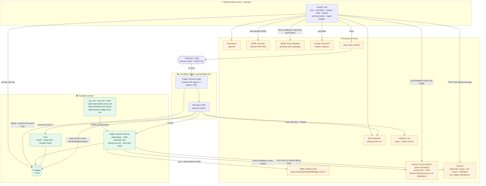
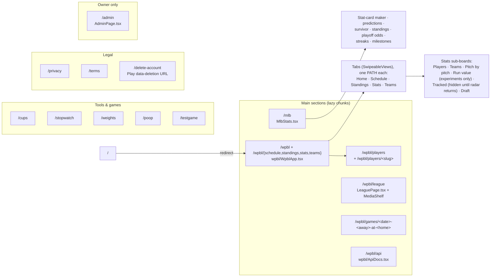
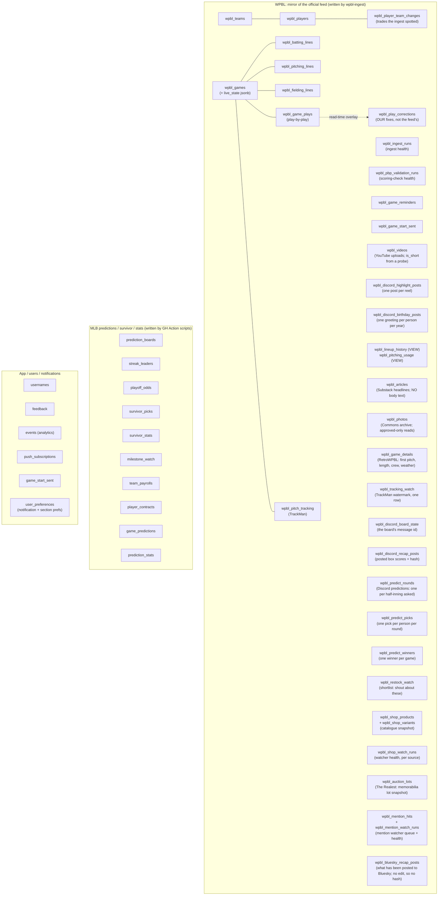
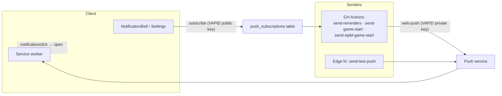

# System Architecture

A single-page **Vite + React (TypeScript, MUI)** app hosted on **Cloudflare Pages** at
`sportydolphin.fun`, backed by **Supabase** (Postgres + Auth + Edge Functions + pg_cron),
with a fleet of **GitHub Actions** cron jobs for the periodic/back-end work. It hosts two
main sections: **MLB** (predictions, survivor, stat cards) and **WPBL** (a mirror of the
Women's Pro Baseball League official feed): plus a few small tools/games.

> **Keep this current.** When you add a table, a cron workflow, an edge function, or an
> external integration, update the matching diagram/table below. Each section notes the
> source of truth in the repo so it stays verifiable.

---

## 1. Whole system at a glance



**Two ways data reaches the DB:** (1) the browser writes user-generated rows directly
through RLS (events, feedback, picks); (2) everything derived or ingested is written by
**service-role** actors: the `wpbl-ingest` edge function (WPBL feed) and the GitHub
Actions scripts (MLB predictions, boards, odds, streaks). The browser only ever reads
those.

---

## 2. Frontend: routes & sections

Client-side routing in [`src/App.tsx`](src/App.tsx) (no framework router; matches
`window.location.pathname`). Heavy sections are `lazy()`-loaded chunks. `/` redirects to
`/wpbl`.



- **Shared shell:** toolbar with search bridge, theme (`ThemeContext`), units
  (`UnitsContext`), the WPBL innings basis for ERA
  ([`EraBasisContext`](src/wpbl/EraBasisContext.tsx): mounted in the shell rather than in
  `/wpbl` because the Settings dialog is shell chrome and has to reach it from either
  section), auth (`AuthContext`), accessibility prefs
  ([`AccessibilityContext`](src/AccessibilityContext.tsx): text scale and a swipe-navigation
  opt-out), MLB⇆WPBL switch, and desktop scaling: `--app-type` / `--app-chrome` on `/wpbl`,
  `--app-shell` on the toolbar, and the legacy `--app-zoom` still on `/mlb` (see the traps in
  CLAUDE.md and item 0 in ROADMAP-WPBL.md).
- **WPBL tab pager:** [`src/wpbl/SwipeableViews.tsx`](src/wpbl/SwipeableViews.tsx),
  finger-tracking mobile swipe with keep-alive + idle neighbor pre-warming. Two scroll
  models via its `mode` prop: `window` for the section's own tabs (the page scrolls; each
  tab keeps its own `window.scrollY` and lands under the pinned nav) and `pane` for the
  Game Center's Recap / Box Score / Play-by-Play / Pitch Data tabs, which sit in a modal
  with the body locked, so each pane scrolls itself instead.
- **WPBL URLs are paths, not query strings** ([`src/wpbl/routes.ts`](src/wpbl/routes.ts)):
  one path per tab since Aug 21, 2026, so each has its own title, description and canonical
  and Google has five WPBL pages to rank instead of one. `/wpbl?view=<tab>` still resolves
  (301'd at the edge). A tab lives in **four** places that must agree: `routes.ts`,
  [`src/seo.ts`](src/seo.ts), `public/_redirects` (both blocks) and the `Route` union in
  `App.tsx`; [`src/wpbl/__tests__/routes.test.ts`](src/wpbl/__tests__/routes.test.ts) pins
  them together because three of the four failures are invisible under `npm run dev`.
- **The WPBL derive layer** ([`src/wpbl/derive/`](src/wpbl/derive)) is pure: arrays in, plain
  shapes out, no supabase and no React, so the same code serves the site, the Discord posters
  and the Deno ingest. `playByPlay` (parse a play, `runsOnPlay`), `runExpectancy` (the league's
  own run-expectancy table and what each play was worth: **in the tree, deliberately not yet
  behind the experiments switch**), `firsts`, `recap` / `discordRecap`,
  `predictions`, `trivia`, `bracket`, `seeding`, `pitches`, `matchups`, `mvpRace`, `feedHealth`.
- **Settings** ([`src/SettingsDialog.tsx`](src/SettingsDialog.tsx)) is split by league, with
  a WPBL / MLB switch seeded from the section the reader came from, so a WPBL-only visitor
  never scrolls past thirty MLB crests. Account, accessibility, app and danger-zone settings
  sit outside that split; the device-level "stop all push" control does too, because one
  subscription delivers every reminder on the site.
- **Reduced motion** is honoured site-wide from `src/styles.css`, with
  [`src/lib/motion.ts`](src/lib/motion.ts) for programmatic scrolls, which CSS cannot reach.
  Colour tokens that have to clear WCAG AA in both themes (`--wpbl-pos`, `--wpbl-neg`,
  `--wpbl-medal-*`, `--wpbl-accent-fg`, `--wpbl-accent-solid`) are defined there too, keyed
  on `[data-theme]`.
- **`/admin`**: the owner's analytics dashboard plus the operational admin tools (they
  used to be a dialog off the account menu; there is deliberately one surface now). Reads
  the `events` table through owner-guarded `security definer` RPCs. Three groups since
  Aug 20, 2026: **Audience** (the analytics, and the only group the range/league filters
  govern), **Health** (the four background pipelines, with a summary strip that follows you
  across the other groups) and **Tools**. See
  [`docs/ADMIN_ANALYTICS.md`](docs/ADMIN_ANALYTICS.md), whose security section is
  load-bearing. The route gate is cosmetic; the RPC guards are the boundary.
- **Client libs** ([`src/lib/`](src/lib)): `supabase` (anon client), `analytics`
  (→ `events` table), `analyticsAdmin` (owner-only reads of it), `push`, `notifications`,
  `adminUsers`, `feedback`, `userActive`, `usernames`, `units`.

---

## 3. Database (Supabase Postgres)

Tables grouped by domain. The pre-runner **baseline** schema is the legacy
[`scripts/*.sql`](scripts) files (`create_*`, `add_*`, `seed_*`), applied once by hand;
**new** schema changes go through the migration runner
([`scripts/migrations/`](scripts/migrations) + `npm run migrate`, see §10). Public reads go
through **RLS**; service-role actors bypass it to write.



Feed identity is reconciled by `api_id` (games) and fuzzy roster matching in the ingest
function, so our readable team slugs / player UUIDs stay stable across feed spelling
variants.

**A player's feed id is not the player.** The league mints a NEW `player_id` when someone
changes club, flags both ACTIVE and links them with nothing, so `wpbl_players.api_ids` holds
every id a person has ever had (`api_id` is whichever is current) and the ingest matches on
any of them. `team_as_of` records the date of the newest box score that placed her on
`team_id`, which is what stops a re-read of an old game from undoing a trade, and every move
the ingest makes on its own is logged to `wpbl_player_team_changes`. Historical team is never
read off the roster row: box-score lines and plays each carry the club that game was played
for, and that is what the game logs, team pages and Hall of Firsts use.

**`wpbl_play_corrections` is the one WPBL table the feed does not write.** It holds our own
fixes to the league's scoring and is applied as a read-time overlay, because `wpbl_game_plays`
is a mirror that `wpbl-ingest` deletes and reinserts wholesale on every pass, so an edit made
in place would vanish at the next cron tick. See
[`docs/PLAY_VALIDATION.md`](docs/PLAY_VALIDATION.md).

**`wpbl_photos` is the one WPBL table whose rows are not public simply by existing.** Its
`select` policy is `using (approved)`, not `using (true)`, because the unreviewed Commons
backlog is the majority of the table and includes files that are correctly categorised on
Commons and still have no business on the site. `fetchWpblPhotos` deliberately does not
repeat the filter in the query, so nobody can mistake a client-side `.eq()` for the thing
keeping the backlog private. See [`docs/COMMONS_PHOTOS.md`](docs/COMMONS_PHOTOS.md).

**Reserved, unread column:** `user_preferences.wpbl_favorite_team_id` (text) exists in
production but nothing reads it, because the favourite-team feature it belongs to is parked on the
`wpbl-favorite-team` branch (see ROADMAP-WPBL.md, "Parked, with reasons"). It shipped
ahead of its feature only because it had already been applied when the work was parked, and
omitting the file made the migration runner report a missing-file warning on every machine.

---

## 4. WPBL ingest pipeline

The one automated write path into the WPBL tables.
[`supabase/functions/wpbl-ingest/index.ts`](supabase/functions/wpbl-ingest/index.ts),
scheduled by [`scripts/wpbl_cron.sql`](scripts/wpbl_cron.sql).

```mermaid
sequenceDiagram
    participant Cron as pg_cron (every 2 min)
    participant Net as pg_net + Vault
    participant Fn as wpbl-ingest (Edge Fn)
    participant Feed as WPBL Official Feed
    participant DB as Postgres (service role)
    participant App as Browser (WPBL section)

    Cron->>Net: fire job "wpbl-ingest-active"
    Net->>Fn: POST /functions/v1/wpbl-ingest {mode:"active"}<br/>Bearer = service-role key from Vault
    Fn->>Feed: GET schedule + boxscores for non-final games
    Feed-->>Fn: games, lines, fielding, plays, TrackMan
    Fn->>Fn: reconcile teams (api_id) + players (fuzzy match)
    Fn->>DB: upsert games / lines / plays / pitch_tracking (idempotent)
    Fn->>DB: record wpbl_ingest_runs (health)
    App->>DB: read via RLS (cached client-side; polls faster while live)
```

- **Modes:** `active` (default: only games not yet `final`), `all` (full backfill),
  `gameId` (one game), `force` (re-pull finals for corrections).
- **Idempotent** → safe to run every 2 minutes; finished games stop costing anything.

---

## 5. Scheduled jobs

### GitHub Actions (`.github/workflows/*.yml`): all times **UTC**, all also `workflow_dispatch`

| Workflow | Schedule (UTC) | Script(s) | Purpose |
|---|---|---|---|
| `daily-bots` | `0 14` + `30 15` (retry) | `update-payrolls`, `run-bots`, `run-survivor-bots` | Bot predictions + survivor picks before first pitch; refresh payrolls |
| `daily-reminders` | `0 16` | `send-reminders` | Push: nudge users to make their picks |
| `game-start-reminders` | `*/5 15-23,0-4 * 3-10` | `send-game-start` | Push: MLB game starting soon (in-season, active hours) |
| `wpbl-game-start-reminders` | `*/10 15-23,0-2` (Mar-Oct) | `send-wpbl-game-start` | Push: WPBL game starting soon |
| `wpbl-discord-board` | `*/15 14-23,0-3` (Mar-Oct) | `update-wpbl-discord-board` | Self-editing WPBL "next games" Discord message |
| `wpbl-discord-postseason` | `15 */3` (Sep-Oct) | `sync-wpbl-discord-postseason` | Reconcile the bracket's Discord watch-party events against the feed: name each for the clubs that made the round, follow a rescheduled first pitch, and delete the games a clinched series will never play. Needs a bot token (scheduled events have no webhook path); a no-op when no bracket events exist |
| `wpbl-discord-recaps` | `0 18-23,0-4` (hourly, Mar-Oct) | `post-wpbl-discord-recaps` | Backstop + corrections for the Discord recaps `wpbl-ingest` posts (a final it missed; a box score revised afterwards) |
| `wpbl-youtube-sync` | `0,30 14-23,0-3` | `sync-wpbl-youtube`, `post-wpbl-discord-highlights` | Mirror WPBL YouTube uploads → `wpbl_videos` (the Highlights segment of Home's media shelf + game recaps), then post anything new to the Discord highlights channel in the same pass. **Two streams:** game highlight reels, identified from the title by `classify()`, and **Shorts**, identified by probing `youtube.com/shorts/<id>` (200 = Short, 303 to `/watch` = not) because no title reveals a Short. Each stream seeds itself the first time the job meets it, so adding one never floods the channel |
| `wpbl-discord-birthdays` | `20 14` (daily) | `post-wpbl-discord-birthdays` | Post the day's roster birthdays to the Discord birthdays channel, and nothing at all on the days nobody has one |
| `wpbl-substack-sync` | `0 12-23` (hourly) | `sync-wpbl-substack` | Mirror an independent writer's WPBL posts → `wpbl_articles` (the Reading segment of Home's media shelf, game story card, player/team "written about"), resolving each to the players, clubs and game it is about |
| `wpbl-tracking-watch` | `30 8` (daily) | `watch-wpbl-tracking` | Notice when the league resumes publishing TrackMan data → `wpbl_tracking_watch`, and say so in Discord. Replaced a Home teaser card that hid itself when the feed fell behind, which meant nothing was watching for its return. **Cannot fire any more, as of Sep 1, 2026**: it reads our own tables, and the endpoints that would fill them are now API-key gated (see the feed row in §8). Left running because it costs one query a day and the gate may lift; it is no longer evidence of anything while it stays quiet |
| `wpbl-retro-sync` | `0 10` (daily) | `retro-sync` | Pull the per-game facts the league feed does not publish from RetroWPBL's event files → `wpbl_game_details` (first pitch, length of game, umpiring crew, weather), shown under the Game Center scoreboard. Matches on (date, home club); an unmatched game is counted and skipped, never guessed at. The source is hand-transcribed and runs several games behind, so a missing row means "not written up yet" and coverage is reported rather than warned about |
| `wpbl-commons-sync` | `0 9 * * 0` (weekly, Sun) | `sync-wpbl-commons` | Mirror freely licensed women's baseball photography from Wikimedia Commons → `wpbl_photos` (the Archive segment of Home's media shelf + the full gallery). Writes to a review queue: rows land `approved = false` and nothing renders until a human publishes them ([`docs/COMMONS_PHOTOS.md`](docs/COMMONS_PHOTOS.md)) |
| `resolve-survivor` | `30 6` | `resolve-survivor` | Grade survivor picks overnight |
| `update-playoff-odds` | `20 6` | `simulate-playoff-odds` | Monte-Carlo playoff odds |
| `update-streaks` | `0 6` + `0 23` + `0 3` (in-season) | `update-streaks` | Streak leaderboards |
| `update-milestones` | `0 7` | `update-milestones` | Milestone watch |
| `update-prediction-boards` | `30 7` | `update-prediction-boards` | Prediction leaderboards |
| `pull-feature-requests` | `0 5` | `pull-tasks` | Google Tasks → `docs/feature-requests.md` / feedback |
| `build-sitemap` | `40 6` | `sitemap` | Rebuild `public/sitemap.xml` from the roster (one URL per player) and commit it **only if the URL set changed**: a push to main is a deploy, so an unconditional rewrite would ship one a day for nothing |
| `wpbl-restock-watch` | `*/10 * * * *` | `watch-wpbl-restock` | Two sources. **Shopify store, every run:** mirror the catalogue and announce new merch + restocks, quiet batched feed to the shop channel, loud `@everyone` for the shortlist. **The Realest, hourly:** mirror the league's memorabilia lots and announce new ones, quietly, in the same shop channel. There are no restocks there because every lot is one of one. The hourly gate is in the script (a check against the last attempt in `wpbl_shop_watch_runs`), not in the cron, because GitHub's schedule slips and two cron lines would collide on the hour. Notifies only, never buys and never bids (see [`docs/DISCORD.md`](docs/DISCORD.md)) |
| `wpbl-bluesky-recaps` | `repository_dispatch` (`wpbl-final`), + `*/15 * * * *` as backstop | `post-wpbl-bluesky-recaps` | Post a finished WPBL game to our own Bluesky timeline: the recap as text, the box score as a rendered image (Bluesky has no monospace, so the Discord table cannot be reused). **The only job here that publishes to a third-party platform**, and it posts to our own account only. Bluesky posts cannot be EDITED, so unlike the Discord recap nothing is ever re-sent: a game is published only once the LEAGUE's own `source_updated_at` on it is 45 minutes old, so corrections land first. That basis matters: it used to be measured from when this job first saw the game, which needed two runs to publish anything and, against GitHub's real cadence, made a 45-minute window a 5-to-12-hour one. The database now triggers it (`wpbl-bluesky-nudge`, pg_cron table below). Never backfills |
| `wpbl-mention-watch` | `*/15 * * * *` | `watch-wpbl-mentions` | Search Reddit posts, Reddit comments (search does not index them, and the question is usually a reply in somebody else's game thread) and Bluesky for people asking where to follow a WPBL game, and digest the threads worth answering into a private Discord channel. **Finds threads, never replies to them**: the only place it posts is our own webhook. Facebook is absent because no permitted automated path to group content exists (see [`docs/DISCORD.md`](docs/DISCORD.md)) |
| `wpbl-pbp-validation` | `0 8` | `validate-wpbl-pbp` | Check the league's play-by-play against the rules of baseball; records health to `wpbl_pbp_validation_runs`. **Never fails on findings** (see [`docs/PLAY_VALIDATION.md`](docs/PLAY_VALIDATION.md)) |
| `wpbl-drift-check` | `30 7` | `check-drift` | Re-read every completed game from the league feed and compare it with the mirror, then re-ingest whatever moved (`{ gameId }` per game, never `force`). Exists because `wpbl-ingest` stops re-reading a game once it is stored final: the only gate that reopens one is the late-TrackMan backfill, so corrections have been arriving as a side effect of the league's tracking being stalled, and never at all past 21 days. **Fails only when a repair did not reconcile the two**, which is the one case needing a person. Runs half an hour ahead of the validator so that one reads corrected data |
| `wpbl-retro-stats-check` | `0 11` | `check-retro` | Derive per-batter PA/AB/H/2B/3B/HR/BB/SO/HBP from RetroWPBL's hand-written Retrosheet files and diff them against our box-score lines. **The only check here not downstream of the league feed**: the drift checker compares our mirror with the league's API and the play-by-play validator tests that API against the rules of baseball, so neither can see an error the LEAGUE made. Baselined like the validator (two people watching one game always disagree about something) and goes red on anything NEW. Runs an hour after the retro sync so a game transcribed overnight is in place. Writes nothing, ever: their play records are read, added up and thrown away, because a second stored copy of the play-by-play would be a second truth |
| `wpbl-archive` | `0 22 * * 0` (weekly, Sun) | `archive` | Write the season's public record to `archive/wpbl-2026/` and commit it **only when the data changed**, so a quiet week costs no deploy. Reads through the ANON key on purpose: the files go in git, so the export must be incapable of holding anything that was not already public, and RLS is what enforces that. **Not a database backup** (no auth, analytics, feedback, push or predictions): it exists because on Sep 22 the feed goes quiet and the mirror stops being a cache of someone else's data and becomes the only copy of the inaugural season we control. Fails rather than writing a partial file if any table reads short of the server's own row count. See [`archive/README.md`](archive/README.md) |
| `wpbl-postseason-check` | `40 */6` (Sep + Oct only) | `check-postseason` | Compare the league's published postseason dates against the feed's own `game_type` / `counts_in_standings`, and **fail loudly** when they disagree. The exact opposite policy to the row above, deliberately: that one reports dozens of known findings nightly and a red X would be noise, this one has nothing to say on any ordinary day and goes red once, on the day `countsInStandings` needs widening. Until then every season total on the site is silently folding the postseason in. The date is allowed to raise the alarm and never to decide what counts: a rained-out regular-season game made up on Sep 8 must not vanish from the standings |

**The three game-dependent WPBL jobs carry a `3-10` season window**, matching the MLB ones.
The 2026 feed runs Aug 1 to Sep 22, postseason included, and then goes quiet until spring, and without a window they
spend the winter waking a runner ~139 times a day to find no game, which buries real failures
in noise. The window is wider than the season we know about on purpose: 2026 was the inaugural
year, and a window that clips a real 2027 season would fail silently. `wpbl-youtube-sync` is
deliberately NOT gated: the channel keeps posting out of season, and the Highlights segment
would stop updating all winter. Every one of them has `workflow_dispatch` for an off-season run.

> Ordering is intentional (see each workflow's header comment): bots/survivor pick *before*
> first pitch (14:00); grading + boards run overnight after west-coast finals (06:00–07:30).

### pg_cron (in-database): [`scripts/wpbl_cron.sql`](scripts/wpbl_cron.sql)

| Job | Schedule | Action |
|---|---|---|
| `wpbl-ingest-active` | `*/2 * * * *` | `pg_net` POST → `wpbl-ingest` `{mode:"active"}` (key from Vault) |
| `wpbl-bluesky-nudge` | `*/5 * * * *` | `wpbl_bluesky_nudge()`: when a WPBL final has been settled 45 min, `pg_net` POST → GitHub `repository_dispatch` `{event_type:"wpbl-final"}` (fine-grained PAT from Vault), so the Bluesky recap does not wait on GitHub's schedule. **Exists because GitHub does not honour `schedule` in this repo**: the 30 scheduled runs before Sep 3, 2026 came 130 to 452 min apart against a `*/15` cron, and the daily workflows ran 4 to 11 hours late, all of them green. Returns 0 and warns (never errors) when no token is in Vault, and the workflow's own `schedule:` line stays as the late-but-not-broken backstop |

---

## 6. Notifications / Web Push



De-dupe guards (`game_start_sent`, `wpbl_game_start_sent`) keep each reminder to one send.
Setup walkthrough: [`docs/PUSH_NOTIFICATIONS.md`](docs/PUSH_NOTIFICATIONS.md).

---

## 7. External integrations

| Service | Used by | For |
|---|---|---|
| **MLB StatsAPI** (`statsapi.mlb.com`) | SPA + `run-bots`, `update-*`, `simulate-playoff-odds` | Schedule, standings, stats, people, transactions |
| **mlbstatic.com** | SPA | Team logos + player photos |
| **FanGraphs** | `update-payrolls` | Team payroll data |
| **WPBL Official Feed** (`stats.womensprobaseballleague.com/v1`) | `wpbl-ingest` | Games, box scores, play-by-play. **TrackMan closed Sep 1, 2026**: `/activity` and `/pitches` answer `401 missing api key`, the stats site's root went behind a login, and the box score's embedded `tracking_activity` now returns empty even for the two games that have tracking. `/games` and `/games/{id}/boxscore` stay open, which is everything the ingest actually needs, and `fetchTracking` already falls back to the box score on a non-OK response, so the pass logs a warning and writes the rest. The 766 rows we hold survive only because that write is guarded by `if (tracking.length)`: an empty fetch writes nothing rather than deleting, unlike `syncGameRows`, which clears a game's rows when the feed sends none. Do not "tidy" that asymmetry |
| **WPBL YouTube** (channel RSS `feeds/videos.xml`, or the Data API when `YOUTUBE_API_KEY` is set) | `sync-wpbl-youtube` | Highlight/recap videos → `wpbl_videos`; SPA embeds via youtube-nocookie on click. Also probes `youtube.com/shorts/<id>` once per new upload to fill `is_short`: **null there means undetermined, never "no"**, since YouTube bot-gates this repo from CI IPs and a gate read as "not a Short" would permanently exclude a clip from the Discord channel. Only a 200 or a redirect to `/watch` is recorded, and a value already stored is never re-probed |
| **towards a more perfect game** (`towardsamoreperfectgame.substack.com`) | `sync-wpbl-substack` | An independent writer's WPBL coverage: headline, dek, cover, word count and link → `wpbl_articles`, matched to players/clubs/games. **The article body is never stored.** The RSS feed carries the full text, and the job reads it only to find names in it; `wpbl_articles` has no body column so the rule is enforced by the schema. Every surface links out to her site |
| **RetroWPBL** (`github.com/exu6jh/RetroWPBL`) | `sync-wpbl-retro` | An independent hand transcription of the season into Retrosheet format, **used with the transcriber's explicit permission (granted Aug 21, 2026)**; the repository carries no licence file, so that permission is the whole basis for using it and is credited in the UI wherever the data renders. Only the event files' `info` records are read: first pitch, `timeofgame`, the umpiring crew and the weather, none of which exist anywhere in the league feed. **The play records are deliberately not mirrored** (we hold the play-by-play in more depth already, and a second copy would be a second truth); the value of that independent transcription is as a CHECK on ours, which is a different job. Attendance is present upstream and is 0 on every row, so it is not stored. **Umpire names come from `biodata/biofile.csv`, not `umpires/UMPIRES2026.txt`**, which is stale; an id that resolves to no name is dropped and counted, never rendered |
| **Wikimedia Commons** (`commons.wikimedia.org/w/api.php`) | `sync-wpbl-commons` | Freely licensed photographs of women's baseball → `wpbl_photos`, walked from three seed categories. **Public domain, CC0, CC BY and CC BY-SA only**, tested on the machine-readable licence slug: Commons is not uniformly free. Attribution and a link to the file page are rendered on every card, because CC BY-SA requires it. Descriptions and credits are stored as plain text, never HTML. A contact-carrying user-agent is mandatory, not polite ([`docs/COMMONS_PHOTOS.md`](docs/COMMONS_PHOTOS.md)) |
| **WPBL Shop** (`shop.womensprobaseballleague.com`, Shopify) | `watch-wpbl-restock` | The published catalogue via `/products.json`, diffed against a stored snapshot to find new merch and restocks. **Read-only, and it stays that way**: the job announces and never carts or checks out |
| **The Realest** (`therealest.com/wpbl`, marketplace) | `watch-wpbl-restock` | The league's memorabilia lots via `api.therealest.com/v1/search?partner=WPBL`, diffed against `wpbl_auction_lots` to find new ones. Game-used bases, game-worn jerseys, locker nameplates, lineup cards, infield dirt: **one-of-one, so there is no restock**, and a new `lot_id` is the only announcement. Filter on `partner`, not on the text `q=WPBL`: the partner is who consigned the lot, and the text match misses the ones titled only "Opening Day Game-Used Rosin Bag". `limit` caps at 100 and the real count is in `pagination.total`, so a short read **errors** rather than degrading, the same rule as the league feed's `/games`. **`api.therealest.com/robots.txt` is `Disallow: /`**, which on an API subdomain normally means "keep out of the search index" rather than "no clients", but it is still their stated wish: hence hourly rather than every ten minutes, an honest user-agent naming the site and a contact, and a `WPBL_AUCTION_WATCH=off` repository variable that stops it without a deploy. Read-only: it announces, and never bids or buys |
| **Discord webhooks** (send-only) | `update-wpbl-discord-board`, `wpbl-ingest`, `post-wpbl-discord-recaps`, `post-wpbl-discord-highlights`, `post-wpbl-discord-birthdays`, `watch-wpbl-restock` | Self-editing WPBL board + events/watch-party links; per-game box scores posted as a game goes final and edited in place on a correction; new YouTube highlight reels and Shorts posted once each; a birthday greeting on the days someone has one; shop restock alerts and new memorabilia lots |
| **Discord interactions** (inbound) | [`functions/discord/wpbl.ts`](functions/discord/wpbl.ts) | The `/player` slash command: an HTTP interactions endpoint (no gateway bot, nothing long-running), answering with a player's season and serving name autocomplete. Also `/predict`, the mod-run in-game predictions game (every round is about a half-inning that has not started, which is what makes it fair), whose answer buttons arrive here as component interactions |
| **Discord message edits** (outbound) | the same function + [`wpbl-ingest/settle-predictions.ts`](supabase/functions/wpbl-ingest/settle-predictions.ts) | Editing a prediction round's own message to reveal the answer. Prefers `DISCORD_BOT_TOKEN` (no time limit, needs the app in the guild via the `bot` scope) and falls back to the round's interaction token (no credential, dies after 15 minutes). A half-inning takes ~10 minutes to play out, so the fallback alone leaves many cards stale; the round still grades and scores either way |
| **Google Tasks API** | `pull-tasks` | Ingest feature requests |
| **Web Push (VAPID)** | reminder scripts + `send-test-push` | Browser notifications |
| **Google OAuth** | `AuthContext` via Supabase Auth | Sign-in |
| **Supabase Auth email** | `AuthContext` | Sign-up confirmation and password reset. Links redirect back to whatever page they were requested from, so **every such origin must be in the project's redirect allow-list** or supabase silently substitutes the Site URL (which is why a local reset link lands on production unless `http://localhost:*` is allowed). The client runs the default `implicit` flow, so the callback arrives in the URL fragment; `AuthContext` reads its `type` at module scope and then drives both dialogs off `getSession()`, because neither `PASSWORD_RECOVERY` nor `SIGNED_IN` can be relied on to reach a listener in time |

---

## 8. Edge Functions (Deno): [`supabase/functions/`](supabase/functions)

| Function | Trigger | Purpose |
|---|---|---|
| `wpbl-ingest` | pg_cron (every 2m) + manual | Mirror the WPBL official feed into Postgres (idempotent); posts a game's box score to Discord on a not-final → final transition ([`announce-final.ts`](supabase/functions/wpbl-ingest/announce-final.ts)); locks, grades and reveals any open Discord prediction rounds against the half-innings it just wrote, and crowns one winner per game on that same final transition ([`settle-predictions.ts`](supabase/functions/wpbl-ingest/settle-predictions.ts)) |
| `wpbl-substack-sync` | pg_cron (hourly, :17) + manual | Mirror an independent writer's WPBL coverage into `wpbl_articles`: headline, dek, cover, word and clip counts, and which players/clubs/game each post is about. Never stores her article text. Runs here rather than in GitHub Actions because Substack serves Cloudflare's JS challenge to Actions runners and not to Supabase ([`docs/READING.md`](docs/READING.md)). Logic shared with `npm run substack-sync` via [`src/wpbl/substackSync.ts`](src/wpbl/substackSync.ts) |
| `delete-account` | SPA (authed user) | Delete the calling user's auth record + app rows |
| `send-test-push` | SPA (Admin panel) | One-off Web Push to the caller's own devices |

`SUPABASE_URL` / `SUPABASE_SERVICE_ROLE_KEY` are injected automatically; VAPID secrets and
`DISCORD_RECAP_WEBHOOK_URL` are set via `supabase secrets set` (the recap webhook is
optional, and without it `wpbl-ingest` skips the Discord post and the hourly job covers it). Walkthrough: [`supabase/functions/README.md`](supabase/functions/README.md).

---

## 9. Configuration / secrets reference

| Scope | Vars | Where |
|---|---|---|
| **Client (build-time)** | `VITE_SUPABASE_URL`, `VITE_SUPABASE_ANON_KEY` | Cloudflare Pages env + `.env` |
| **Pages Functions** (`functions/wpbl`, `functions/discord/wpbl`) | the same `VITE_SUPABASE_URL` / `VITE_SUPABASE_ANON_KEY`, plus `SUPABASE_SERVICE_ROLE_KEY` for `/predict` only | Cloudflare Pages env (available to functions at runtime). The Discord app's Ed25519 public key is committed in the function rather than held here, since it verifies Discord's signatures and grants nothing, so it survives redeploys with nothing to re-enter. **The service-role key is the one real secret here**: `/predict` writes picks, the predictions tables are RLS-on with no policies, and the anon key ships in the client bundle so it cannot be trusted to say which Discord user a pick belongs to |
| **Migration runner** | `SUPABASE_DB_URL` (Postgres connection string, Supabase *session pooler*, port 5432) | `.env` locally + repo **Actions secret** |
| **Edge functions** | `SUPABASE_URL`*, `SUPABASE_SERVICE_ROLE_KEY`*, `VAPID_PUBLIC_KEY`, `VAPID_PRIVATE_KEY`, `VAPID_SUBJECT`, `DISCORD_RECAP_WEBHOOK_URL`, `DISCORD_BOT_TOKEN` (for the `/predict` reveal) | Supabase (*auto-injected) |
| **pg_cron** | service-role key; `github_dispatch_token` (fine-grained PAT on `sportydolphin/fun`, Contents: read+write, used only to fire the Bluesky nudge's `repository_dispatch`) | Supabase **Vault** (`wpbl_service_role_key`, `github_dispatch_token`) |
| **GitHub Actions** | `SUPABASE_URL`, `SUPABASE_SERVICE_ROLE_KEY`, `SUPABASE_DB_URL`, `VAPID_*`, `DISCORD_BOARD_WEBHOOK_URL`, `DISCORD_BOARD_MESSAGE_ID`, `DISCORD_EVENTS_URL`, `DISCORD_WATCH_PARTY_VC_URL`, `DISCORD_RECAP_WEBHOOK_URL`, `DISCORD_HIGHLIGHTS_WEBHOOK_URL`, `DISCORD_BIRTHDAY_WEBHOOK_URL`, `DISCORD_RESTOCK_WEBHOOK_URL`, `DISCORD_SHOP_WEBHOOK_URL`, `DISCORD_RESTOCK_MENTION` (optional), `DISCORD_MENTIONS_WEBHOOK_URL`, `DISCORD_MENTIONS_MENTION` (optional), `DISCORD_BOT_TOKEN` (the postseason event sync, the only Actions job that writes to Discord with the bot rather than a webhook), `REDDIT_CLIENT_ID`, `REDDIT_CLIENT_SECRET`, `BLUESKY_IDENTIFIER`, `BLUESKY_APP_PASSWORD` (shared by the mention watcher, which only reads, and the Bluesky recap poster, which publishes), `GOOGLE_CLIENT_ID`, `GOOGLE_CLIENT_SECRET`, `GOOGLE_REFRESH_TOKEN`, `GOOGLE_TASKS_LIST` | Repo **Actions secrets** |

---

## 10. Deploy & hosting

- **Frontend:** `vite build` → **Cloudflare Pages** (`sportydolphin.fun`), deployed on push
  to `main`.
- **Brand icons:** every icon the site publishes (tab, home screen, install tile,
  notification, social card) is generated from the one logo master, `public/logo.png`, by
  [`scripts/make-brand-icons.py`](scripts/make-brand-icons.py). That script is a manual
  design step, not part of the build: run it when the art changes and commit what it
  rewrites. **`public/icon.svg` is one of its outputs, so hand-edits there are lost on the
  next run.** Which file fills which slot, and why no one file can fill them all, is in the
  script's own docstring. `index.html` declares the tab, apple-touch and social tags;
  `public/manifest.webmanifest` declares the install tiles; `public/sw.js` names the
  notification image and badge.
- **Installed app / offline:** [`public/sw.js`](public/sw.js) has two jobs and only two:
  receive Web Push, and answer a **navigation** that cannot reach the network with
  [`public/offline.html`](public/offline.html), a static dependency-free page served with a
  503. It still does **not** cache the app shell and must not start: a cached shell is a
  stale app that renders perfectly and is therefore invisible. Only the offline page and the
  three images it draws are precached, navigations are network-first, and nothing is written
  back. The offline page exists for the Android wrapper below, where there is no browser
  chrome to explain a dead network and Chrome's dinosaur would otherwise fill the screen
  under our icon. Pinned by [`src/__tests__/pwaShell.test.ts`](src/__tests__/pwaShell.test.ts).
- **Android app (built and device-verified, not yet on Play):** a Trusted Web Activity
  generated by Bubblewrap from the live `manifest.webmanifest`, so the web deploy *is* the app
  deploy and the `.aab` is rebuilt only when the name, icon, package id or target SDK change.
  The Bubblewrap project is the sibling directory `../sportydolphin-android`, deliberately
  outside this repo so the keystore cannot be committed beside tracked files.
  `public/.well-known/assetlinks.json` is what removes the URL bar; it currently carries the
  upload key only, and needs Google's Play App Signing fingerprint added after the first
  upload or the build Play serves will show a URL bar that a sideloaded APK does not. Plan of
  record, including why it is not Capacitor (Google blocks OAuth in embedded WebViews, and
  sign-in is a Google OAuth flow): [`docs/ANDROID.md`](docs/ANDROID.md).
- **iOS app (not started; only the web half exists):** there is no TWA on iOS, so this is a
  Capacitor project rather than a second export target, and it means rebuilding Google
  sign-in (Google refuses OAuth in a WebView), adding APNs alongside Web Push, and clearing
  App Store guideline 4.2. **Try the free option first**: iOS Safari already installs the
  site as a PWA and, since 16.4, that install can receive Web Push. Live ahead of the app:
  `public/.well-known/apple-app-site-association`, **carrying a placeholder Team ID**, plus
  its content-type rule in `public/_headers`, both pinned in `pwaShell.test.ts`. Plan of
  record: [`docs/IOS.md`](docs/IOS.md).
- **Link previews:** [`functions/wpbl/index.ts`](functions/wpbl/index.ts) is a Pages
  Function that rewrites the Open Graph tags of `/wpbl?player=<id>` at the edge, so a
  shared player link unfurls with that player's name, club, and season line instead of the
  site's generic card (unfurlers don't run JS, so `src/seo.ts` can't reach them). Wording
  lives in [`src/wpbl/ogCard.ts`](src/wpbl/ogCard.ts). The image is a per-player 1200x630
  card generated by
  [`scripts/make-wpbl-share-cards.py`](scripts/make-wpbl-share-cards.py) and republished,
  with the headshots it is built from, at `/cards/<slug>.webp` and `/portraits/<slug>.webp`
  by [`scripts/vite-plugin-wpbl-images.mjs`](scripts/vite-plugin-wpbl-images.mjs), since
  the edge has no copy of the build's hashed-asset map. It is a whole card rather than the
  headshot because Bluesky and anything else reading only `og:` puts whatever it is given
  into one 1.91:1 banner, and a square arrived centre-cropped across the player's face. It **edits** `index.html`'s tags
  and never appends: unfurlers read the first occurrence of a property, so a default that
  ships in the static head cannot be overridden by a tag added after it.
- **Discord bot:** [`functions/discord/wpbl.ts`](functions/discord/wpbl.ts) is a second
  Pages Function, serving the `/player` slash command as an HTTP interactions endpoint,
  Discord POSTs the command and takes the reply from the response body, so there is no
  gateway websocket and no process to keep running. Verifies Discord's Ed25519 signature,
  resolves the typed name against the roster
  ([`src/wpbl/playerSearch.ts`](src/wpbl/playerSearch.ts)), and answers from the same
  `stats.ts` aggregation the site uses. Setup: [`docs/DISCORD.md`](docs/DISCORD.md).
- **`public/_routes.json` is an allow-list**, and it gates both of the above: only the paths
  named in `include` invoke the Functions worker, everything else is served as a plain
  asset with no function run. **Adding a function under `functions/` is not enough. Its
  route has to be added here too**, or it compiles, uploads, deploys and is then never
  called. It **narrows only**: routing is by file path, so `functions/wpbl/index.ts` serves
  `/wpbl` and nothing below it no matter what `include` says. The subtree is covered by the
  catch-all `functions/wpbl/[[tab]].ts`, which re-exports `onRequestGet` so the two cannot
  drift; without it a player shared from `/wpbl/stats?player=…` unfurls as the generic card. `npm run check-functions` bundles the functions the way Cloudflare will, since a
  failed functions build leaves the previous deployment serving rather than failing the
  deploy.
- **`public/_redirects` is the SPA route table**, and it is also an allow-list. Pages' own
  default is to serve the shell with a 200 for any unmatched path, which made every typo on
  the domain a valid, indexable page (Google indexed `/wpbl),and`, picked up from a mangled
  pasted link). The file inverts that: each app route gets a `200` rewrite to `/` plus a
  `301` folding its trailing-slash spelling, and everything else falls through to
  `public/404.html` with a real 404. **There is deliberately no `/*` rule doing that**:
  Cloudflare validates the file at upload time and rejects the whole thing for any status
  outside 200/301/302/303/307/308, which fails the build and leaves the previous deploy
  serving, so the site does not break, it silently stops updating. `/*  /404.html  404` did
  exactly that on Aug 21, 2026. The rule was never needed, because serving that file for an
  unmatched path is the platform default once it exists. Static assets and the Functions
  above are both matched ahead of the fallback. **A new route in the `Route` union in
  [`src/App.tsx`](src/App.tsx) needs a line in both blocks here**, or it 404s in production
  and works fine in dev, since Vite serves the shell for everything. Check a build with
  `npx wrangler pages dev dist`. The two wildcards, `/wpbl/players/*` and `/wpbl/games/*`,
  exist because the valid slugs are rows in `wpbl_players` and `wpbl_games`; the Pages
  Function 404s unknown ones first, which is the only thing keeping those directories from
  being an infinite set of 200s. Note there is deliberately no `/wpbl/games` line: there is
  no games index, so the bare path falls through to the 404.
- **`public/sitemap.xml` is generated** by `npm run sitemap`
  ([`scripts/build-sitemap.ts`](scripts/build-sitemap.ts)): the static routes, one URL per
  player, and one per game that has been PLAYED, all read live. A scheduled game is left out
  until it is final, because until then its page is a preview with no box score. It warns
  loudly if two players share a slug, since that is the one case where a player's URL is not
  simply their name. Re-run it when the roster or the results change; a hand-edit is lost.
- **Edge functions:** `supabase functions deploy <name>` (manual). `wpbl-ingest` also
  announces a game to Discord the moment it sees it go final
  ([`announce-final.ts`](supabase/functions/wpbl-ingest/announce-final.ts)): the
  scheduled `wpbl-discord-recaps` job then only handles what the ingest missed and
  later corrections. Both render through `src/wpbl/derive/discordRecap.ts` and claim
  the game by primary key in `wpbl_discord_recap_posts`, so neither double-posts.
  Silent until `DISCORD_RECAP_WEBHOOK_URL` is set as a function secret.
- **DB schema:** `npm run migrate` applies pending [`scripts/migrations/*.sql`](scripts/migrations)
  (tracked in a `schema_migrations` table; needs `SUPABASE_DB_URL`). The legacy
  `scripts/*.sql` baseline was applied by hand and is not re-run.
- **pg_cron:** `scripts/wpbl_cron.sql` once, after deploying `wpbl-ingest`.
- **Cron scripts:** run automatically by GitHub Actions (Node 20/22 runners) using repo
  secrets.

---

### Source-of-truth index
- Routing/shell → [`src/App.tsx`](src/App.tsx)
- WPBL section → [`src/wpbl/`](src/wpbl) (`WpblApp.tsx`, `api.ts`, `SwipeableViews.tsx`)
- MLB section → [`src/MlbStats.tsx`](src/MlbStats.tsx), [`src/mlb/`](src/mlb)
- DB schema → baseline [`scripts/*.sql`](scripts) · new changes [`scripts/migrations/`](scripts/migrations) via [`scripts/migrate.mjs`](scripts/migrate.mjs)
- Cron → [`.github/workflows/`](.github/workflows) + [`scripts/wpbl_cron.sql`](scripts/wpbl_cron.sql)
- Discord (board + box scores + the `/predict` game) → [`docs/DISCORD.md`](docs/DISCORD.md)
- Win probability through a game, and what each play did to it (the chart and the "swing of the game" line on Game Center's Recap tab, **behind the experiments switch**) → [`src/wpbl/derive/winProbability.ts`](src/wpbl/derive/winProbability.ts), drawn by [`src/wpbl/WinProbView.tsx`](src/wpbl/WinProbView.tsx). It looks nothing up: the run-expectancy cells carry a run histogram as well as a mean, and win probability falls out of convolving those backwards from the last out. Team-neutral by construction, and measured on 263 half-innings, both of which the card says on its face
- What a situation is worth, and what each play was worth (the Run value board on Stats, **behind the experiments switch while it settles**) → [`src/wpbl/derive/runExpectancy.ts`](src/wpbl/derive/runExpectancy.ts), drawn by [`src/wpbl/RunValueView.tsx`](src/wpbl/RunValueView.tsx). The table is built from THIS league's plays, never a borrowed major-league one: the WPBL scores ~15 runs a game over seven innings, so every state is worth roughly double. Two boards draw it: the Run value leaderboard, and the Findings card "What every kind of play is worth" ([`src/wpbl/FindingsView.tsx`](src/wpbl/FindingsView.tsx)). **The explanation lives on Run value and only there**: one shut card, three steps (a situation is worth something, with the 24-cell grid as its evidence; a play is worth what it changed, with the formula as three named terms; one real play, with those same terms as a ledger), then the caveats. It used to be split across both boards with neither half whole and neither mentioning the other, so Findings now links across instead of carrying a second copy, and the link opens the card. The example is CHOSEN by `workedExample()` (the play nearest its own event's average) rather than written down, because the table moves with every ingest and pasted numbers would silently stop matching it. The ledger's total is the sum of its own rounded terms rather than the rounded true value, so the column a reader is invited to check actually adds up
- Why a game that should have started is showing nothing → [`src/wpbl/derive/feedHealth.ts`](src/wpbl/derive/feedHealth.ts), drawn by [`src/wpbl/FeedDelayNote.tsx`](src/wpbl/FeedDelayNote.tsx) on Home's next-game card and in Game Center. **It exists to tell two identical-looking silences apart**: the league not publishing, and our own ingest having stopped. `wpbl_games` carries both clocks, and only the combination "ours fresh, theirs stale" licenses pointing upstream, so the check reads `updated_at` BEFORE `source_updated_at` and reports our own outage as ours. Gated on the scheduled first pitch having passed, without which every future game on the calendar reports a broken feed (a row three days out has a month-old `source_updated_at` by construction). Live case that produced it: Aug 30, 2026, the league's record frozen at 21:54:31Z through a 23:30Z first pitch while our cron ran clean every two minutes
- Who is having the best season, on one number a hitter and a pitcher can share (the MVP race card on Home) → [`src/wpbl/derive/mvpRace.ts`](src/wpbl/derive/mvpRace.ts), drawn by [`src/wpbl/MvpRace.tsx`](src/wpbl/MvpRace.tsx). Runs created at the plate plus runs saved on the mound, summed off `playRunValues`, so it is the same number the Run value board publishes rather than a second estimate of it. A box-score run estimator was prototyped and rejected for exactly that reason: a calibrated Base Runs fit prices a WPBL home run at +1.33 against the league's own +1.55, which would have put two "runs added" figures for one player on the same site. **Not WAR**: no replacement level, no positional adjustment, no fielding, and no baserunning (a steal carries no pitch sequence, so it belongs to no plate appearance and is credited to nobody). It is the only surface here that reads both sides of the ball, which is why a two-way player leads it while trailing on the batting board. Regular season only, for free: both engine functions run their input through `regularSeasonLines`
- Where the league's players come from, out of one free-text `hometown` column → [`src/wpbl/derive/hometowns.ts`](src/wpbl/derive/hometowns.ts), drawn by [`src/wpbl/LeaguePage.tsx`](src/wpbl/LeaguePage.tsx) at `/wpbl/league`. **Not a map, deliberately**: there are no coordinates in the payload and no honest way to invent them from a string where "Ontario, California, USA" and "Oakville, Ontario, Canada" share a word. The country sections fold, and a closed one is hidden with CSS rather than unmounted, because the page's 118 player anchors are the crawl path it exists for
- Prediction/trivia question rules → [`src/wpbl/derive/predictions.ts`](src/wpbl/derive/predictions.ts), [`src/wpbl/derive/trivia.ts`](src/wpbl/derive/trivia.ts)
- Owner analytics (`/admin`, the `admin_*` RPCs) → [`docs/ADMIN_ANALYTICS.md`](docs/ADMIN_ANALYTICS.md)
- Android app / TWA plan, and the offline page it exists for → [`docs/ANDROID.md`](docs/ANDROID.md), [`public/sw.js`](public/sw.js)
- Brand icons (favicon, home screen, install tiles, social card) → [`scripts/make-brand-icons.py`](scripts/make-brand-icons.py), from [`public/logo.png`](public/logo.png)
- Player share cards, and why og:image is not the headshot → [`scripts/make-wpbl-share-cards.py`](scripts/make-wpbl-share-cards.py), from [`src/wpbl/portraits/`](src/wpbl/portraits/) plus the club colours in [`src/wpbl/constants.ts`](src/wpbl/constants.ts). **Rerun it after a trade**: the club on the art is the club the roster named the day it was generated
- Scoring validation + our play corrections → [`docs/PLAY_VALIDATION.md`](docs/PLAY_VALIDATION.md)
- Whether our BATTING LINES are right, as opposed to faithfully mirrored → [`scripts/check-wpbl-retro-stats.mjs`](scripts/check-wpbl-retro-stats.mjs), against RetroWPBL. Everything else validates the feed or our copy of it; this is the only thing that can disagree with the league and be right. Baseball Reference carries the WPBL too and is not usable for it: 403 to automated fetchers, and their terms forbid automated collection
- Whether the mirror still matches the league feed, and how a late correction reaches us at all → [`scripts/check-wpbl-drift.mjs`](scripts/check-wpbl-drift.mjs). `wpbl-ingest` never re-reads a game once it is stored final unless something reopens it, and the only thing that does on a schedule is the late-TrackMan backfill (finals under 21 days old with no tracking rows). The league keeps revising box scores well past that, and its `/games` list hides it: `updated_at` there freezes at `completed_at` while the boxscore's own `source_updated_at` moves for weeks
- What ERA is divided by, and why it follows the league rather than the arithmetic → `ERA_BASIS_CANONICAL` in [`src/wpbl/stats.ts`](src/wpbl/stats.ts) (stored value, never a setting) with the reader's override in [`src/wpbl/EraBasisContext.tsx`](src/wpbl/EraBasisContext.tsx) (display only). **Per 7 since Sep 3, 2026, per 9 before that**, because the league changed and this follows it. The reasoning and the sources are the Aug 26 and Sep 3, 2026 entries in [`ROADMAP-WPBL.md`](ROADMAP-WPBL.md)
- Which position a player is listed at (the season overrides the roster) → [`src/wpbl/positions.ts`](src/wpbl/positions.ts), shared by the site, the unfurl card and the Discord bot
- Which CLUB a player counted for (the line overrides the roster, because people get traded) → the `team_id` on each box-score line and play; the rules that recognise a trade are `tradeMatch` / `teamMoveWins` in [`supabase/functions/wpbl-ingest/names.ts`](supabase/functions/wpbl-ingest/names.ts), and `wpbl_merge_players(keep, dupe)` folds a duplicate back into one person
- iOS / App Store plan, and the Universal Links file already live ahead of the app → [`docs/IOS.md`](docs/IOS.md), [`public/.well-known/apple-app-site-association`](public/.well-known/apple-app-site-association)
- The Substack mirror (why it runs on Supabase and not Actions, and why no body text is stored) → [`docs/READING.md`](docs/READING.md)
- SEO work that is not code (backlinks: who to contact, and the drafts) → [`docs/BACKLINKS.md`](docs/BACKLINKS.md)
- Archive gallery: which photos ship, and the approval gate → [`docs/COMMONS_PHOTOS.md`](docs/COMMONS_PHOTOS.md)
- What a finished game looks like on a public timeline, and why it is an image rather than a table → [`src/wpbl/derive/blueskyRecap.ts`](src/wpbl/derive/blueskyRecap.ts) and [`scripts/post-wpbl-bluesky-recaps.ts`](scripts/post-wpbl-bluesky-recaps.ts)
- Finding the people already asking where to follow a game (which platforms permit it, which need a credential, why a comment is judged differently from a post, and why the job never replies) → [`scripts/watch-wpbl-mentions.mjs`](scripts/watch-wpbl-mentions.mjs) and the "mention watcher" section of [`docs/DISCORD.md`](docs/DISCORD.md)
- Reading, Highlights and Archive share ONE Home card, one segment painting at a time →
  [`src/wpbl/MediaShelf.tsx`](src/wpbl/MediaShelf.tsx). Three feeds, three tables, one surface:
  a new feed belongs in that card rather than as a fourth rail down the page
- Local-dev-only controls (skin, device sim, simulated login, notification tester, the WPBL Discord-invite undo) → [`src/dev/DevSettings.tsx`](src/dev/DevSettings.tsx), gated on `import.meta.env.DEV`. **Anything it reaches into has to be import-light**: App.tsx imports that file eagerly while both sections are `lazy()`, so a convenience import from inside `MlbStats`/`WpblApp` pulls that section's chunk into the main bundle for every visitor, in production, to serve a control that only exists in dev. That is why the invite's dismissal key and its undo live in their own [`src/wpbl/discordInvite.ts`](src/wpbl/discordInvite.ts) rather than in `Home.tsx`
- Edge functions → [`supabase/functions/`](supabase/functions) · Cloudflare Pages functions → [`functions/`](functions)
- Cron script logic → [`scripts/*.mjs`](scripts) · the Discord recap poster is TS
  ([`scripts/post-wpbl-discord-recaps.ts`](scripts/post-wpbl-discord-recaps.ts)), bundled at CI
  time so it can share the site's recap engine; its message lives in
  [`src/wpbl/derive/discordRecap.ts`](src/wpbl/derive/discordRecap.ts)
