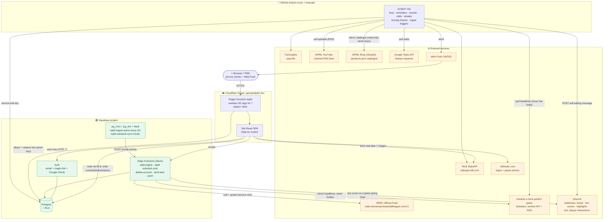
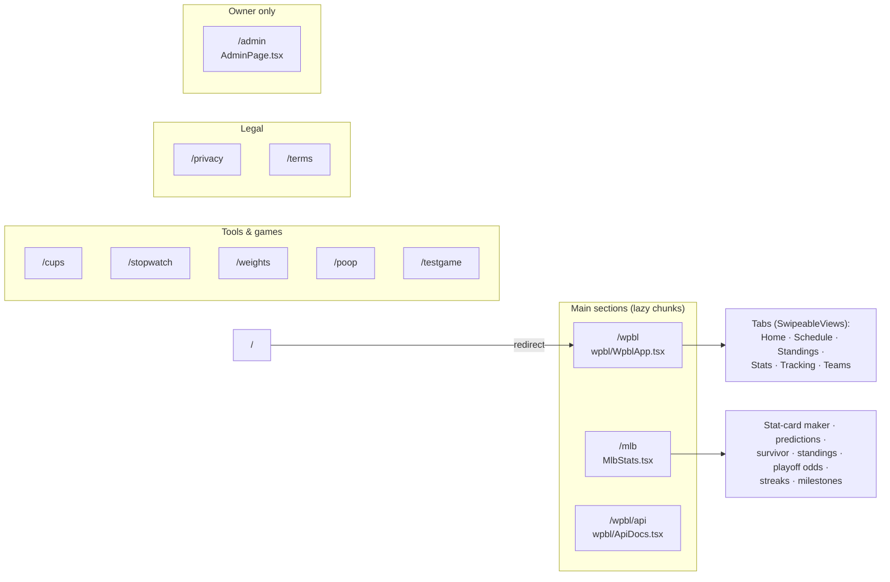
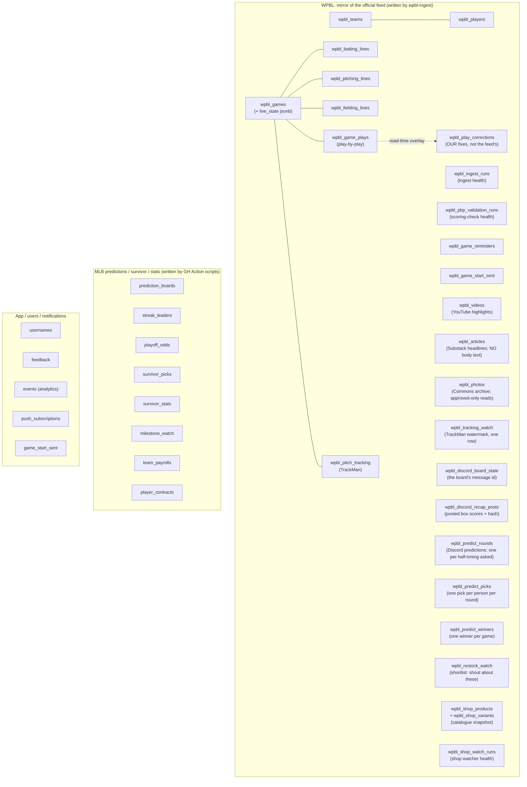
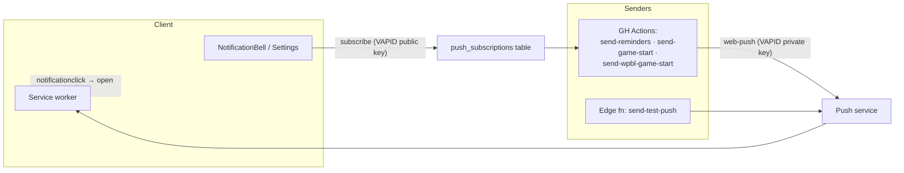

# System Architecture

A single-page **Vite + React (TypeScript, MUI)** app hosted on **Cloudflare Pages** at
`sportydolphin.fun`, backed by **Supabase** (Postgres + Auth + Edge Functions + pg_cron),
with a fleet of **GitHub Actions** cron jobs for the periodic/back-end work. It hosts two
main sections: **MLB** (predictions, survivor, stat cards) and **WPBL** (a mirror of the
Women's Pro Baseball League official feed): plus a few small tools/games.

> **Keep this current.** When you add a table, a cron workflow, an edge function, or an
> external integration, update the matching diagram/table below. Each section notes the
> source of truth in the repo so it stays verifiable.

---

## 1. Whole system at a glance



**Two ways data reaches the DB:** (1) the browser writes user-generated rows directly
through RLS (events, feedback, picks); (2) everything derived or ingested is written by
**service-role** actors: the `wpbl-ingest` edge function (WPBL feed) and the GitHub
Actions scripts (MLB predictions, boards, odds, streaks). The browser only ever reads
those.

---

## 2. Frontend: routes & sections

Client-side routing in [`src/App.tsx`](src/App.tsx) (no framework router; matches
`window.location.pathname`). Heavy sections are `lazy()`-loaded chunks. `/` redirects to
`/wpbl`.



- **Shared shell:** toolbar with search bridge, theme (`ThemeContext`), units
  (`UnitsContext`), auth (`AuthContext`), accessibility prefs
  ([`AccessibilityContext`](src/AccessibilityContext.tsx): text scale and a swipe-navigation
  opt-out), MLB⇆WPBL switch, `--app-zoom` desktop scaling.
- **WPBL tab pager:** [`src/wpbl/SwipeableViews.tsx`](src/wpbl/SwipeableViews.tsx),
  finger-tracking mobile swipe with keep-alive + idle neighbor pre-warming. Two scroll
  models via its `mode` prop: `window` for the section's own tabs (the page scrolls; each
  tab keeps its own `window.scrollY` and lands under the pinned nav) and `pane` for the
  Game Center's Recap / Box Score / Play-by-Play / Pitch Data tabs, which sit in a modal
  with the body locked, so each pane scrolls itself instead.
- **Settings** ([`src/SettingsDialog.tsx`](src/SettingsDialog.tsx)) is split by league, with
  a WPBL / MLB switch seeded from the section the reader came from, so a WPBL-only visitor
  never scrolls past thirty MLB crests. Account, accessibility, app and danger-zone settings
  sit outside that split; the device-level "stop all push" control does too, because one
  subscription delivers every reminder on the site.
- **Reduced motion** is honoured site-wide from `src/styles.css`, with
  [`src/lib/motion.ts`](src/lib/motion.ts) for programmatic scrolls, which CSS cannot reach.
  Colour tokens that have to clear WCAG AA in both themes (`--wpbl-pos`, `--wpbl-neg`,
  `--wpbl-medal-*`, `--wpbl-accent-fg`, `--wpbl-accent-solid`) are defined there too, keyed
  on `[data-theme]`.
- **`/admin`**: the owner's analytics dashboard plus the operational admin tools (they
  used to be a dialog off the account menu; there is deliberately one surface now). Reads
  the `events` table through owner-guarded `security definer` RPCs. Three groups since
  Aug 20, 2026: **Audience** (the analytics, and the only group the range/league filters
  govern), **Health** (the four background pipelines, with a summary strip that follows you
  across the other groups) and **Tools**. See
  [`docs/ADMIN_ANALYTICS.md`](docs/ADMIN_ANALYTICS.md), whose security section is
  load-bearing. The route gate is cosmetic; the RPC guards are the boundary.
- **Client libs** ([`src/lib/`](src/lib)): `supabase` (anon client), `analytics`
  (→ `events` table), `analyticsAdmin` (owner-only reads of it), `push`, `notifications`,
  `adminUsers`, `feedback`, `userActive`, `usernames`, `units`.

---

## 3. Database (Supabase Postgres)

Tables grouped by domain. The pre-runner **baseline** schema is the legacy
[`scripts/*.sql`](scripts) files (`create_*`, `add_*`, `seed_*`), applied once by hand;
**new** schema changes go through the migration runner
([`scripts/migrations/`](scripts/migrations) + `npm run migrate`, see §10). Public reads go
through **RLS**; service-role actors bypass it to write.



Feed identity is reconciled by `api_id` (games) and fuzzy roster matching in the ingest
function, so our readable team slugs / player UUIDs stay stable across feed spelling
variants.

**`wpbl_play_corrections` is the one WPBL table the feed does not write.** It holds our own
fixes to the league's scoring and is applied as a read-time overlay, because `wpbl_game_plays`
is a mirror that `wpbl-ingest` deletes and reinserts wholesale on every pass, so an edit made
in place would vanish at the next cron tick. See
[`docs/PLAY_VALIDATION.md`](docs/PLAY_VALIDATION.md).

**`wpbl_photos` is the one WPBL table whose rows are not public simply by existing.** Its
`select` policy is `using (approved)`, not `using (true)`, because the unreviewed Commons
backlog is the majority of the table and includes files that are correctly categorised on
Commons and still have no business on the site. `fetchWpblPhotos` deliberately does not
repeat the filter in the query, so nobody can mistake a client-side `.eq()` for the thing
keeping the backlog private. See [`docs/COMMONS_PHOTOS.md`](docs/COMMONS_PHOTOS.md).

**Reserved, unread column:** `user_preferences.wpbl_favorite_team_id` (text) exists in
production but nothing reads it, because the favourite-team feature it belongs to is parked on the
`wpbl-favorite-team` branch (see ROADMAP-WPBL.md, "Parked, with reasons"). It shipped
ahead of its feature only because it had already been applied when the work was parked, and
omitting the file made the migration runner report a missing-file warning on every machine.

---

## 4. WPBL ingest pipeline

The one automated write path into the WPBL tables.
[`supabase/functions/wpbl-ingest/index.ts`](supabase/functions/wpbl-ingest/index.ts),
scheduled by [`scripts/wpbl_cron.sql`](scripts/wpbl_cron.sql).

```mermaid
sequenceDiagram
    participant Cron as pg_cron (every 2 min)
    participant Net as pg_net + Vault
    participant Fn as wpbl-ingest (Edge Fn)
    participant Feed as WPBL Official Feed
    participant DB as Postgres (service role)
    participant App as Browser (WPBL section)

    Cron->>Net: fire job "wpbl-ingest-active"
    Net->>Fn: POST /functions/v1/wpbl-ingest {mode:"active"}<br/>Bearer = service-role key from Vault
    Fn->>Feed: GET schedule + boxscores for non-final games
    Feed-->>Fn: games, lines, fielding, plays, TrackMan
    Fn->>Fn: reconcile teams (api_id) + players (fuzzy match)
    Fn->>DB: upsert games / lines / plays / pitch_tracking (idempotent)
    Fn->>DB: record wpbl_ingest_runs (health)
    App->>DB: read via RLS (cached client-side; polls faster while live)
```

- **Modes:** `active` (default: only games not yet `final`), `all` (full backfill),
  `gameId` (one game), `force` (re-pull finals for corrections).
- **Idempotent** → safe to run every 2 minutes; finished games stop costing anything.

---

## 5. Scheduled jobs

### GitHub Actions (`.github/workflows/*.yml`): all times **UTC**, all also `workflow_dispatch`

| Workflow | Schedule (UTC) | Script(s) | Purpose |
|---|---|---|---|
| `daily-bots` | `0 14` + `30 15` (retry) | `update-payrolls`, `run-bots`, `run-survivor-bots` | Bot predictions + survivor picks before first pitch; refresh payrolls |
| `daily-reminders` | `0 16` | `send-reminders` | Push: nudge users to make their picks |
| `game-start-reminders` | `*/5 15-23,0-4 * 3-10` | `send-game-start` | Push: MLB game starting soon (in-season, active hours) |
| `wpbl-game-start-reminders` | `*/10 15-23,0-2` (Mar-Oct) | `send-wpbl-game-start` | Push: WPBL game starting soon |
| `wpbl-discord-board` | `*/15 14-23,0-3` (Mar-Oct) | `update-wpbl-discord-board` | Self-editing WPBL "next games" Discord message |
| `wpbl-discord-recaps` | `0 18-23,0-4` (hourly, Mar-Oct) | `post-wpbl-discord-recaps` | Backstop + corrections for the Discord recaps `wpbl-ingest` posts (a final it missed; a box score revised afterwards) |
| `wpbl-youtube-sync` | `0,30 14-23,0-3` | `sync-wpbl-youtube`, `post-wpbl-discord-highlights` | Mirror WPBL YouTube uploads → `wpbl_videos` (the Highlights segment of Home's media shelf + game recaps), then post any new highlight reel to the Discord highlights channel in the same pass |
| `wpbl-discord-birthdays` | `20 14` (daily) | `post-wpbl-discord-birthdays` | Post the day's roster birthdays to the Discord birthdays channel, and nothing at all on the days nobody has one |
| `wpbl-substack-sync` | `0 12-23` (hourly) | `sync-wpbl-substack` | Mirror an independent writer's WPBL posts → `wpbl_articles` (the Reading segment of Home's media shelf, game story card, player/team "written about"), resolving each to the players, clubs and game it is about |
| `wpbl-tracking-watch` | `30 8` (daily) | `watch-wpbl-tracking` | Notice when the league resumes publishing TrackMan data → `wpbl_tracking_watch`, and say so in Discord. Replaced a Home teaser card that hid itself when the feed fell behind, which meant nothing was watching for its return |
| `wpbl-commons-sync` | `0 9 * * 0` (weekly, Sun) | `sync-wpbl-commons` | Mirror freely licensed women's baseball photography from Wikimedia Commons → `wpbl_photos` (the Archive segment of Home's media shelf + the full gallery). Writes to a review queue: rows land `approved = false` and nothing renders until a human publishes them ([`docs/COMMONS_PHOTOS.md`](docs/COMMONS_PHOTOS.md)) |

**The three game-dependent WPBL jobs carry a `3-10` season window**, matching the MLB ones.
The 2026 feed runs Aug 1 to Sep 22, postseason included, and then goes quiet until spring, and without a window they
spend the winter waking a runner ~139 times a day to find no game, which buries real failures
in noise. The window is wider than the season we know about on purpose: 2026 was the inaugural
year, and a window that clips a real 2027 season would fail silently. `wpbl-youtube-sync` is
deliberately NOT gated: the channel keeps posting out of season, and the Highlights segment
would stop updating all winter. Every one of them has `workflow_dispatch` for an off-season run.

| `resolve-survivor` | `30 6` | `resolve-survivor` | Grade survivor picks overnight |
| `update-playoff-odds` | `20 6` | `simulate-playoff-odds` | Monte-Carlo playoff odds |
| `update-streaks` | `0 6` + `0 23` + `0 3` (in-season) | `update-streaks` | Streak leaderboards |
| `update-milestones` | `0 7` | `update-milestones` | Milestone watch |
| `update-prediction-boards` | `30 7` | `update-prediction-boards` | Prediction leaderboards |
| `pull-feature-requests` | `0 5` | `pull-tasks` | Google Tasks → `docs/feature-requests.md` / feedback |
| `wpbl-restock-watch` | `*/10 * * * *` | `watch-wpbl-restock` | Mirror the league's Shopify catalogue and announce new merch + restocks: quiet batched feed to the shop channel, loud `@everyone` for the shortlist. Notifies only, never buys (see [`docs/DISCORD.md`](docs/DISCORD.md)) |
| `wpbl-pbp-validation` | `0 8` | `validate-wpbl-pbp` | Check the league's play-by-play against the rules of baseball; records health to `wpbl_pbp_validation_runs`. **Never fails on findings** (see [`docs/PLAY_VALIDATION.md`](docs/PLAY_VALIDATION.md)) |

> Ordering is intentional (see each workflow's header comment): bots/survivor pick *before*
> first pitch (14:00); grading + boards run overnight after west-coast finals (06:00–07:30).

### pg_cron (in-database): [`scripts/wpbl_cron.sql`](scripts/wpbl_cron.sql)

| Job | Schedule | Action |
|---|---|---|
| `wpbl-ingest-active` | `*/2 * * * *` | `pg_net` POST → `wpbl-ingest` `{mode:"active"}` (key from Vault) |

---

## 6. Notifications / Web Push



De-dupe guards (`game_start_sent`, `wpbl_game_start_sent`) keep each reminder to one send.
Setup walkthrough: [`docs/PUSH_NOTIFICATIONS.md`](docs/PUSH_NOTIFICATIONS.md).

---

## 7. External integrations

| Service | Used by | For |
|---|---|---|
| **MLB StatsAPI** (`statsapi.mlb.com`) | SPA + `run-bots`, `update-*`, `simulate-playoff-odds` | Schedule, standings, stats, people, transactions |
| **mlbstatic.com** | SPA | Team logos + player photos |
| **FanGraphs** | `update-payrolls` | Team payroll data |
| **WPBL Official Feed** (`stats.womensprobaseballleague.com/v1`) | `wpbl-ingest` | Games, box scores, play-by-play, TrackMan |
| **WPBL YouTube** (channel RSS `feeds/videos.xml`) | `sync-wpbl-youtube` | Highlight/recap videos → `wpbl_videos`; SPA embeds via youtube-nocookie on click |
| **towards a more perfect game** (`towardsamoreperfectgame.substack.com`) | `sync-wpbl-substack` | An independent writer's WPBL coverage: headline, dek, cover, word count and link → `wpbl_articles`, matched to players/clubs/games. **The article body is never stored.** The RSS feed carries the full text, and the job reads it only to find names in it; `wpbl_articles` has no body column so the rule is enforced by the schema. Every surface links out to her site |
| **Wikimedia Commons** (`commons.wikimedia.org/w/api.php`) | `sync-wpbl-commons` | Freely licensed photographs of women's baseball → `wpbl_photos`, walked from three seed categories. **Public domain, CC0, CC BY and CC BY-SA only**, tested on the machine-readable licence slug: Commons is not uniformly free. Attribution and a link to the file page are rendered on every card, because CC BY-SA requires it. Descriptions and credits are stored as plain text, never HTML. A contact-carrying user-agent is mandatory, not polite ([`docs/COMMONS_PHOTOS.md`](docs/COMMONS_PHOTOS.md)) |
| **WPBL Shop** (`shop.womensprobaseballleague.com`, Shopify) | `watch-wpbl-restock` | The published catalogue via `/products.json`, diffed against a stored snapshot to find new merch and restocks. **Read-only, and it stays that way**: the job announces and never carts or checks out |
| **Discord webhooks** (send-only) | `update-wpbl-discord-board`, `wpbl-ingest`, `post-wpbl-discord-recaps`, `post-wpbl-discord-highlights`, `post-wpbl-discord-birthdays`, `watch-wpbl-restock` | Self-editing WPBL board + events/watch-party links; per-game box scores posted as a game goes final and edited in place on a correction; new YouTube highlight reels posted once each; a birthday greeting on the days someone has one; shop restock alerts |
| **Discord interactions** (inbound) | [`functions/discord/wpbl.ts`](functions/discord/wpbl.ts) | The `/player` slash command: an HTTP interactions endpoint (no gateway bot, nothing long-running), answering with a player's season and serving name autocomplete. Also `/predict`, the mod-run in-game predictions game (every round is about a half-inning that has not started, which is what makes it fair), whose answer buttons arrive here as component interactions |
| **Discord message edits** (outbound) | the same function + [`wpbl-ingest/settle-predictions.ts`](supabase/functions/wpbl-ingest/settle-predictions.ts) | Editing a prediction round's own message to reveal the answer. Prefers `DISCORD_BOT_TOKEN` (no time limit, needs the app in the guild via the `bot` scope) and falls back to the round's interaction token (no credential, dies after 15 minutes). A half-inning takes ~10 minutes to play out, so the fallback alone leaves many cards stale; the round still grades and scores either way |
| **Google Tasks API** | `pull-tasks` | Ingest feature requests |
| **Web Push (VAPID)** | reminder scripts + `send-test-push` | Browser notifications |
| **Google OAuth** | `AuthContext` via Supabase Auth | Sign-in |
| **Supabase Auth email** | `AuthContext` | Sign-up confirmation and password reset. Links redirect back to whatever page they were requested from, so **every such origin must be in the project's redirect allow-list** or supabase silently substitutes the Site URL (which is why a local reset link lands on production unless `http://localhost:*` is allowed). The client runs the default `implicit` flow, so the callback arrives in the URL fragment; `AuthContext` reads its `type` at module scope and then drives both dialogs off `getSession()`, because neither `PASSWORD_RECOVERY` nor `SIGNED_IN` can be relied on to reach a listener in time |

---

## 8. Edge Functions (Deno): [`supabase/functions/`](supabase/functions)

| Function | Trigger | Purpose |
|---|---|---|
| `wpbl-ingest` | pg_cron (every 2m) + manual | Mirror the WPBL official feed into Postgres (idempotent); posts a game's box score to Discord on a not-final → final transition ([`announce-final.ts`](supabase/functions/wpbl-ingest/announce-final.ts)); settles any open Discord prediction rounds against the half-innings it just wrote ([`settle-predictions.ts`](supabase/functions/wpbl-ingest/settle-predictions.ts)) |
| `wpbl-substack-sync` | pg_cron (hourly, :17) + manual | Mirror an independent writer's WPBL coverage into `wpbl_articles`: headline, dek, cover, word and clip counts, and which players/clubs/game each post is about. Never stores her article text. Runs here rather than in GitHub Actions because Substack serves Cloudflare's JS challenge to Actions runners and not to Supabase ([`docs/READING.md`](docs/READING.md)). Logic shared with `npm run substack-sync` via [`src/wpbl/substackSync.ts`](src/wpbl/substackSync.ts) |
| `delete-account` | SPA (authed user) | Delete the calling user's auth record + app rows |
| `send-test-push` | SPA (Admin panel) | One-off Web Push to the caller's own devices |

`SUPABASE_URL` / `SUPABASE_SERVICE_ROLE_KEY` are injected automatically; VAPID secrets and
`DISCORD_RECAP_WEBHOOK_URL` are set via `supabase secrets set` (the recap webhook is
optional, and without it `wpbl-ingest` skips the Discord post and the hourly job covers it). Walkthrough: [`supabase/functions/README.md`](supabase/functions/README.md).

---

## 9. Configuration / secrets reference

| Scope | Vars | Where |
|---|---|---|
| **Client (build-time)** | `VITE_SUPABASE_URL`, `VITE_SUPABASE_ANON_KEY` | Cloudflare Pages env + `.env` |
| **Pages Functions** (`functions/wpbl`, `functions/discord/wpbl`) | the same `VITE_SUPABASE_URL` / `VITE_SUPABASE_ANON_KEY`, plus `SUPABASE_SERVICE_ROLE_KEY` for `/predict` only | Cloudflare Pages env (available to functions at runtime). The Discord app's Ed25519 public key is committed in the function rather than held here, since it verifies Discord's signatures and grants nothing, so it survives redeploys with nothing to re-enter. **The service-role key is the one real secret here**: `/predict` writes picks, the predictions tables are RLS-on with no policies, and the anon key ships in the client bundle so it cannot be trusted to say which Discord user a pick belongs to |
| **Migration runner** | `SUPABASE_DB_URL` (Postgres connection string, Supabase *session pooler*, port 5432) | `.env` locally + repo **Actions secret** |
| **Edge functions** | `SUPABASE_URL`*, `SUPABASE_SERVICE_ROLE_KEY`*, `VAPID_PUBLIC_KEY`, `VAPID_PRIVATE_KEY`, `VAPID_SUBJECT`, `DISCORD_RECAP_WEBHOOK_URL`, `DISCORD_BOT_TOKEN` (for the `/predict` reveal) | Supabase (*auto-injected) |
| **pg_cron** | service-role key | Supabase **Vault** (`wpbl_service_role_key`) |
| **GitHub Actions** | `SUPABASE_URL`, `SUPABASE_SERVICE_ROLE_KEY`, `SUPABASE_DB_URL`, `VAPID_*`, `DISCORD_BOARD_WEBHOOK_URL`, `DISCORD_BOARD_MESSAGE_ID`, `DISCORD_EVENTS_URL`, `DISCORD_WATCH_PARTY_VC_URL`, `DISCORD_RECAP_WEBHOOK_URL`, `DISCORD_HIGHLIGHTS_WEBHOOK_URL`, `DISCORD_BIRTHDAY_WEBHOOK_URL`, `DISCORD_RESTOCK_WEBHOOK_URL`, `DISCORD_SHOP_WEBHOOK_URL`, `DISCORD_RESTOCK_MENTION` (optional), `GOOGLE_CLIENT_ID`, `GOOGLE_CLIENT_SECRET`, `GOOGLE_REFRESH_TOKEN`, `GOOGLE_TASKS_LIST` | Repo **Actions secrets** |

---

## 10. Deploy & hosting

- **Frontend:** `vite build` → **Cloudflare Pages** (`sportydolphin.fun`), deployed on push
  to `main`.
- **Brand icons:** every icon the site publishes (tab, home screen, install tile,
  notification, social card) is generated from the one logo master, `public/logo.png`, by
  [`scripts/make-brand-icons.py`](scripts/make-brand-icons.py). That script is a manual
  design step, not part of the build: run it when the art changes and commit what it
  rewrites. **`public/icon.svg` is one of its outputs, so hand-edits there are lost on the
  next run.** Which file fills which slot, and why no one file can fill them all, is in the
  script's own docstring. `index.html` declares the tab, apple-touch and social tags;
  `public/manifest.webmanifest` declares the install tiles; `public/sw.js` names the
  notification image and badge.
- **Link previews:** [`functions/wpbl/index.ts`](functions/wpbl/index.ts) is a Pages
  Function that rewrites the Open Graph tags of `/wpbl?player=<id>` at the edge, so a
  shared player link unfurls with that player's name, club, and season line instead of the
  site's generic card (unfurlers don't run JS, so `src/seo.ts` can't reach them). Wording
  lives in [`src/wpbl/ogCard.ts`](src/wpbl/ogCard.ts). Headshots are republished
  at `/portraits/<slug>.webp` by
  [`scripts/vite-plugin-wpbl-portraits.mjs`](scripts/vite-plugin-wpbl-portraits.mjs), since
  the edge has no copy of the build's hashed-asset map. It **edits** `index.html`'s tags
  and never appends: unfurlers read the first occurrence of a property, so a default that
  ships in the static head cannot be overridden by a tag added after it.
- **Discord bot:** [`functions/discord/wpbl.ts`](functions/discord/wpbl.ts) is a second
  Pages Function, serving the `/player` slash command as an HTTP interactions endpoint,
  Discord POSTs the command and takes the reply from the response body, so there is no
  gateway websocket and no process to keep running. Verifies Discord's Ed25519 signature,
  resolves the typed name against the roster
  ([`src/wpbl/playerSearch.ts`](src/wpbl/playerSearch.ts)), and answers from the same
  `stats.ts` aggregation the site uses. Setup: [`docs/DISCORD.md`](docs/DISCORD.md).
- **`public/_routes.json` is an allow-list**, and it gates both of the above: only the paths
  named in `include` invoke the Functions worker, everything else is served as a plain
  asset with no function run. **Adding a function under `functions/` is not enough. Its
  route has to be added here too**, or it compiles, uploads, deploys and is then never
  called. `npm run check-functions` bundles the functions the way Cloudflare will, since a
  failed functions build leaves the previous deployment serving rather than failing the
  deploy.
- **Edge functions:** `supabase functions deploy <name>` (manual). `wpbl-ingest` also
  announces a game to Discord the moment it sees it go final
  ([`announce-final.ts`](supabase/functions/wpbl-ingest/announce-final.ts)): the
  scheduled `wpbl-discord-recaps` job then only handles what the ingest missed and
  later corrections. Both render through `src/wpbl/derive/discordRecap.ts` and claim
  the game by primary key in `wpbl_discord_recap_posts`, so neither double-posts.
  Silent until `DISCORD_RECAP_WEBHOOK_URL` is set as a function secret.
- **DB schema:** `npm run migrate` applies pending [`scripts/migrations/*.sql`](scripts/migrations)
  (tracked in a `schema_migrations` table; needs `SUPABASE_DB_URL`). The legacy
  `scripts/*.sql` baseline was applied by hand and is not re-run.
- **pg_cron:** `scripts/wpbl_cron.sql` once, after deploying `wpbl-ingest`.
- **Cron scripts:** run automatically by GitHub Actions (Node 20/22 runners) using repo
  secrets.

---

### Source-of-truth index
- Routing/shell → [`src/App.tsx`](src/App.tsx)
- WPBL section → [`src/wpbl/`](src/wpbl) (`WpblApp.tsx`, `api.ts`, `SwipeableViews.tsx`)
- MLB section → [`src/MlbStats.tsx`](src/MlbStats.tsx), [`src/mlb/`](src/mlb)
- DB schema → baseline [`scripts/*.sql`](scripts) · new changes [`scripts/migrations/`](scripts/migrations) via [`scripts/migrate.mjs`](scripts/migrate.mjs)
- Cron → [`.github/workflows/`](.github/workflows) + [`scripts/wpbl_cron.sql`](scripts/wpbl_cron.sql)
- Discord (board + box scores + the `/predict` game) → [`docs/DISCORD.md`](docs/DISCORD.md)
- Prediction/trivia question rules → [`src/wpbl/derive/predictions.ts`](src/wpbl/derive/predictions.ts), [`src/wpbl/derive/trivia.ts`](src/wpbl/derive/trivia.ts)
- Owner analytics (`/admin`, the `admin_*` RPCs) → [`docs/ADMIN_ANALYTICS.md`](docs/ADMIN_ANALYTICS.md)
- Brand icons (favicon, home screen, install tiles, social card) → [`scripts/make-brand-icons.py`](scripts/make-brand-icons.py), from [`public/logo.png`](public/logo.png)
- Scoring validation + our play corrections → [`docs/PLAY_VALIDATION.md`](docs/PLAY_VALIDATION.md)
- Which position a player is listed at (the season overrides the roster) → [`src/wpbl/positions.ts`](src/wpbl/positions.ts), shared by the site, the unfurl card and the Discord bot
- Archive gallery: which photos ship, and the approval gate → [`docs/COMMONS_PHOTOS.md`](docs/COMMONS_PHOTOS.md)
- Reading, Highlights and Archive share ONE Home card, one segment painting at a time →
  [`src/wpbl/MediaShelf.tsx`](src/wpbl/MediaShelf.tsx). Three feeds, three tables, one surface:
  a new feed belongs in that card rather than as a fourth rail down the page
- Edge functions → [`supabase/functions/`](supabase/functions) · Cloudflare Pages functions → [`functions/`](functions)
- Cron script logic → [`scripts/*.mjs`](scripts) · the Discord recap poster is TS
  ([`scripts/post-wpbl-discord-recaps.ts`](scripts/post-wpbl-discord-recaps.ts)), bundled at CI
  time so it can share the site's recap engine; its message lives in
  [`src/wpbl/derive/discordRecap.ts`](src/wpbl/derive/discordRecap.ts)
</content>
</invoke>
