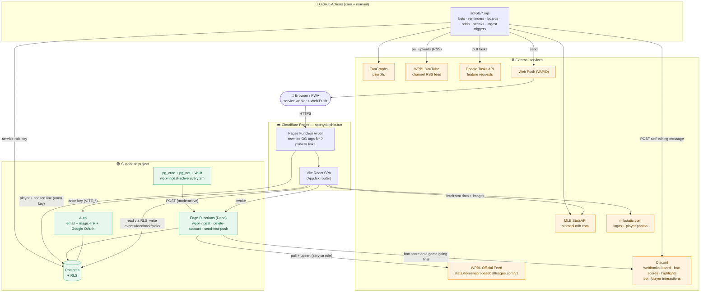
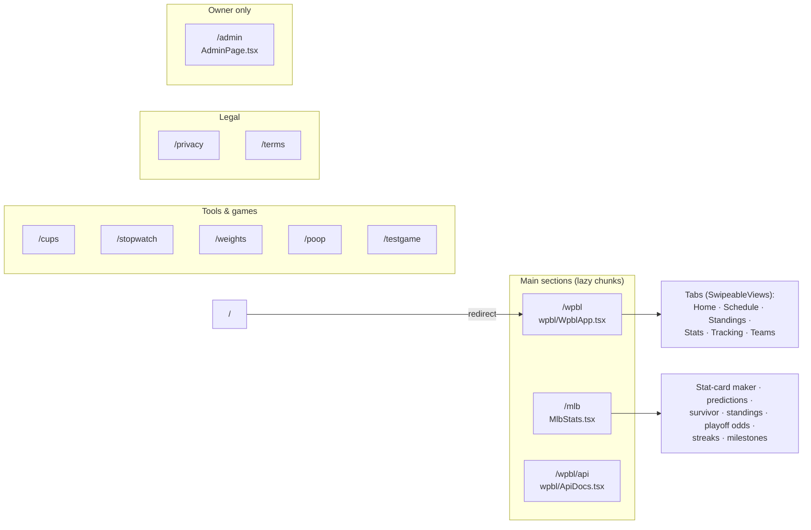
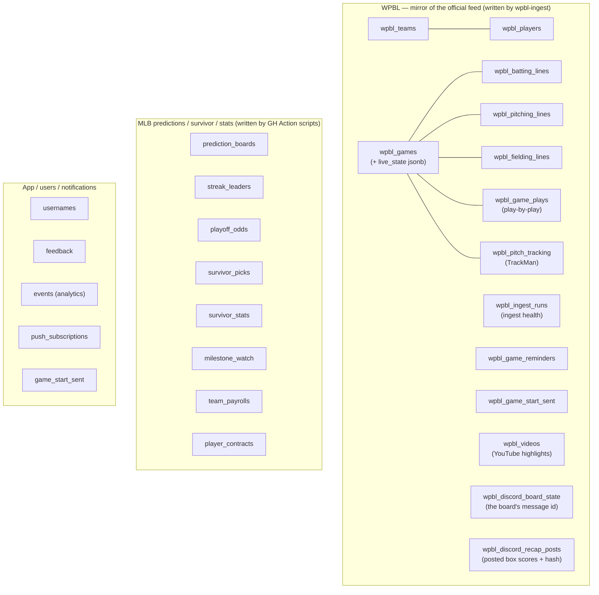
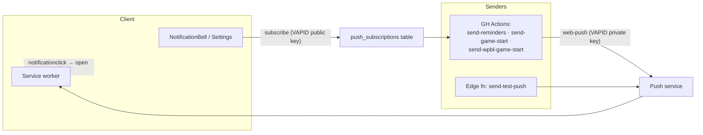

# System Architecture

A single-page **Vite + React (TypeScript, MUI)** app hosted on **Cloudflare Pages** at
`sportydolphin.fun`, backed by **Supabase** (Postgres + Auth + Edge Functions + pg_cron),
with a fleet of **GitHub Actions** cron jobs for the periodic/back-end work. It hosts two
main sections — **MLB** (predictions, survivor, stat cards) and **WPBL** (a mirror of the
Women's Pro Baseball League official feed) — plus a few small tools/games.

> **Keep this current.** When you add a table, a cron workflow, an edge function, or an
> external integration, update the matching diagram/table below. Each section notes the
> source of truth in the repo so it stays verifiable.

---

## 1. Whole system at a glance



**Two ways data reaches the DB:** (1) the browser writes user-generated rows directly
through RLS (events, feedback, picks); (2) everything derived or ingested is written by
**service-role** actors — the `wpbl-ingest` edge function (WPBL feed) and the GitHub
Actions scripts (MLB predictions, boards, odds, streaks). The browser only ever reads
those.

---

## 2. Frontend — routes & sections

Client-side routing in [`src/App.tsx`](src/App.tsx) (no framework router; matches
`window.location.pathname`). Heavy sections are `lazy()`-loaded chunks. `/` redirects to
`/wpbl`.



- **Shared shell:** toolbar with search bridge, theme (`ThemeContext`), units
  (`UnitsContext`), auth (`AuthContext`), MLB⇆WPBL switch, `--app-zoom` desktop scaling.
- **WPBL tab pager:** [`src/wpbl/SwipeableViews.tsx`](src/wpbl/SwipeableViews.tsx) —
  finger-tracking mobile swipe with keep-alive + idle neighbor pre-warming. Two scroll
  models via its `mode` prop: `window` for the section's own tabs (the page scrolls; each
  tab keeps its own `window.scrollY` and lands under the pinned nav) and `pane` for the
  Game Center's Recap / Box Score / Play-by-Play / Pitch Data tabs, which sit in a modal
  with the body locked, so each pane scrolls itself instead.
- **`/admin`** — the owner's analytics dashboard plus the operational admin tools (they
  used to be a dialog off the account menu; there is deliberately one surface now). Reads
  the `events` table through owner-guarded `security definer` RPCs — see
  [`docs/ADMIN_ANALYTICS.md`](docs/ADMIN_ANALYTICS.md), whose security section is
  load-bearing. The route gate is cosmetic; the RPC guards are the boundary.
- **Client libs** ([`src/lib/`](src/lib)): `supabase` (anon client), `analytics`
  (→ `events` table), `analyticsAdmin` (owner-only reads of it), `push`, `notifications`,
  `adminUsers`, `feedback`, `userActive`, `usernames`, `units`.

---

## 3. Database (Supabase Postgres)

Tables grouped by domain. The pre-runner **baseline** schema is the legacy
[`scripts/*.sql`](scripts) files (`create_*`, `add_*`, `seed_*`), applied once by hand;
**new** schema changes go through the migration runner
([`scripts/migrations/`](scripts/migrations) + `npm run migrate`, see §10). Public reads go
through **RLS**; service-role actors bypass it to write.



Feed identity is reconciled by `api_id` (games) and fuzzy roster matching in the ingest
function, so our readable team slugs / player UUIDs stay stable across feed spelling
variants.

**Reserved, unread column:** `user_preferences.wpbl_favorite_team_id` (text) exists in
production but nothing reads it — the favourite-team feature it belongs to is parked on the
`wpbl-favourite-team` branch (see ROADMAP-WPBL.md, "Parked, with reasons"). It shipped
ahead of its feature only because it had already been applied when the work was parked, and
omitting the file made the migration runner report a missing-file warning on every machine.

---

## 4. WPBL ingest pipeline

The one automated write path into the WPBL tables.
[`supabase/functions/wpbl-ingest/index.ts`](supabase/functions/wpbl-ingest/index.ts),
scheduled by [`scripts/wpbl_cron.sql`](scripts/wpbl_cron.sql).

```mermaid
sequenceDiagram
    participant Cron as pg_cron (every 2 min)
    participant Net as pg_net + Vault
    participant Fn as wpbl-ingest (Edge Fn)
    participant Feed as WPBL Official Feed
    participant DB as Postgres (service role)
    participant App as Browser (WPBL section)

    Cron->>Net: fire job "wpbl-ingest-active"
    Net->>Fn: POST /functions/v1/wpbl-ingest {mode:"active"}<br/>Bearer = service-role key from Vault
    Fn->>Feed: GET schedule + boxscores for non-final games
    Feed-->>Fn: games, lines, fielding, plays, TrackMan
    Fn->>Fn: reconcile teams (api_id) + players (fuzzy match)
    Fn->>DB: upsert games / lines / plays / pitch_tracking (idempotent)
    Fn->>DB: record wpbl_ingest_runs (health)
    App->>DB: read via RLS (cached client-side; polls faster while live)
```

- **Modes:** `active` (default — only games not yet `final`), `all` (full backfill),
  `gameId` (one game), `force` (re-pull finals for corrections).
- **Idempotent** → safe to run every 2 minutes; finished games stop costing anything.

---

## 5. Scheduled jobs

### GitHub Actions (`.github/workflows/*.yml`) — all times **UTC**, all also `workflow_dispatch`

| Workflow | Schedule (UTC) | Script(s) | Purpose |
|---|---|---|---|
| `daily-bots` | `0 14` + `30 15` (retry) | `update-payrolls`, `run-bots`, `run-survivor-bots` | Bot predictions + survivor picks before first pitch; refresh payrolls |
| `daily-reminders` | `0 16` | `send-reminders` | Push: nudge users to make their picks |
| `game-start-reminders` | `*/5 15-23,0-4 * 3-10` | `send-game-start` | Push: MLB game starting soon (in-season, active hours) |
| `wpbl-game-start-reminders` | `*/10 15-23,0-2` | `send-wpbl-game-start` | Push: WPBL game starting soon |
| `wpbl-discord-board` | `*/15 14-23,0-3` | `update-wpbl-discord-board` | Self-editing WPBL "next games" Discord message |
| `wpbl-discord-recaps` | `0 18-23,0-4` (hourly) | `post-wpbl-discord-recaps` | Backstop + corrections for the Discord recaps `wpbl-ingest` posts (a final it missed; a box score revised afterwards) |
| `wpbl-youtube-sync` | `0,30 14-23,0-3` | `sync-wpbl-youtube`, `post-wpbl-discord-highlights` | Mirror WPBL YouTube uploads → `wpbl_videos` (highlights rail + game recaps), then post any new highlight reel to the Discord highlights channel in the same pass |
| `resolve-survivor` | `30 6` | `resolve-survivor` | Grade survivor picks overnight |
| `update-playoff-odds` | `0 6` | `simulate-playoff-odds` | Monte-Carlo playoff odds |
| `update-streaks` | `0 6` + `0 23` + `0 3` (in-season) | `update-streaks` | Streak leaderboards |
| `update-milestones` | `0 7` | `update-milestones` | Milestone watch |
| `update-prediction-boards` | `30 7` | `update-prediction-boards` | Prediction leaderboards |
| `pull-feature-requests` | `0 5` | `pull-tasks` | Google Tasks → `docs/feature-requests.md` / feedback |

> Ordering is intentional (see each workflow's header comment): bots/survivor pick *before*
> first pitch (14:00); grading + boards run overnight after west-coast finals (06:00–07:30).

### pg_cron (in-database) — [`scripts/wpbl_cron.sql`](scripts/wpbl_cron.sql)

| Job | Schedule | Action |
|---|---|---|
| `wpbl-ingest-active` | `*/2 * * * *` | `pg_net` POST → `wpbl-ingest` `{mode:"active"}` (key from Vault) |

---

## 6. Notifications / Web Push



De-dupe guards (`game_start_sent`, `wpbl_game_start_sent`) keep each reminder to one send.
Setup walkthrough: [`docs/PUSH_NOTIFICATIONS.md`](docs/PUSH_NOTIFICATIONS.md).

---

## 7. External integrations

| Service | Used by | For |
|---|---|---|
| **MLB StatsAPI** (`statsapi.mlb.com`) | SPA + `run-bots`, `update-*`, `simulate-playoff-odds` | Schedule, standings, stats, people, transactions |
| **mlbstatic.com** | SPA | Team logos + player photos |
| **FanGraphs** | `update-payrolls` | Team payroll data |
| **WPBL Official Feed** (`stats.womensprobaseballleague.com/v1`) | `wpbl-ingest` | Games, box scores, play-by-play, TrackMan |
| **WPBL YouTube** (channel RSS `feeds/videos.xml`) | `sync-wpbl-youtube` | Highlight/recap videos → `wpbl_videos`; SPA embeds via youtube-nocookie on click |
| **Discord webhooks** (send-only) | `update-wpbl-discord-board`, `wpbl-ingest`, `post-wpbl-discord-recaps`, `post-wpbl-discord-highlights` | Self-editing WPBL board + events/watch-party links; per-game box scores posted as a game goes final and edited in place on a correction; new YouTube highlight reels posted once each |
| **Discord interactions** (inbound) | [`functions/discord/wpbl.ts`](functions/discord/wpbl.ts) | The `/player` slash command: an HTTP interactions endpoint (no gateway bot, nothing long-running), answering with a player's season and serving name autocomplete |
| **Google Tasks API** | `pull-tasks` | Ingest feature requests |
| **Web Push (VAPID)** | reminder scripts + `send-test-push` | Browser notifications |
| **Google OAuth** | `AuthContext` via Supabase Auth | Sign-in |

---

## 8. Edge Functions (Deno) — [`supabase/functions/`](supabase/functions)

| Function | Trigger | Purpose |
|---|---|---|
| `wpbl-ingest` | pg_cron (every 2m) + manual | Mirror the WPBL official feed into Postgres (idempotent); posts a game's box score to Discord on a not-final → final transition ([`announce-final.ts`](supabase/functions/wpbl-ingest/announce-final.ts)) |
| `delete-account` | SPA (authed user) | Delete the calling user's auth record + app rows |
| `send-test-push` | SPA (Admin panel) | One-off Web Push to the caller's own devices |

`SUPABASE_URL` / `SUPABASE_SERVICE_ROLE_KEY` are injected automatically; VAPID secrets and
`DISCORD_RECAP_WEBHOOK_URL` are set via `supabase secrets set` (the recap webhook is
optional — without it `wpbl-ingest` skips the Discord post and the hourly job covers it). Walkthrough: [`supabase/functions/README.md`](supabase/functions/README.md).

---

## 9. Configuration / secrets reference

| Scope | Vars | Where |
|---|---|---|
| **Client (build-time)** | `VITE_SUPABASE_URL`, `VITE_SUPABASE_ANON_KEY` | Cloudflare Pages env + `.env` |
| **Pages Functions** (`functions/wpbl`, `functions/discord/wpbl`) | the same `VITE_SUPABASE_URL` / `VITE_SUPABASE_ANON_KEY` | Cloudflare Pages env (available to functions at runtime). The Discord app's Ed25519 public key is committed in the function rather than held here — it verifies Discord's signatures and grants nothing, so it survives redeploys with nothing to re-enter |
| **Migration runner** | `SUPABASE_DB_URL` (Postgres connection string — Supabase *session pooler*, port 5432) | `.env` locally + repo **Actions secret** |
| **Edge functions** | `SUPABASE_URL`*, `SUPABASE_SERVICE_ROLE_KEY`*, `VAPID_PUBLIC_KEY`, `VAPID_PRIVATE_KEY`, `VAPID_SUBJECT`, `DISCORD_RECAP_WEBHOOK_URL` | Supabase (*auto-injected) |
| **pg_cron** | service-role key | Supabase **Vault** (`wpbl_service_role_key`) |
| **GitHub Actions** | `SUPABASE_URL`, `SUPABASE_SERVICE_ROLE_KEY`, `SUPABASE_DB_URL`, `VAPID_*`, `DISCORD_BOARD_WEBHOOK_URL`, `DISCORD_BOARD_MESSAGE_ID`, `DISCORD_EVENTS_URL`, `DISCORD_WATCH_PARTY_VC_URL`, `DISCORD_RECAP_WEBHOOK_URL`, `DISCORD_HIGHLIGHTS_WEBHOOK_URL`, `GOOGLE_CLIENT_ID`, `GOOGLE_CLIENT_SECRET`, `GOOGLE_REFRESH_TOKEN`, `GOOGLE_TASKS_LIST` | Repo **Actions secrets** |

---

## 10. Deploy & hosting

- **Frontend:** `vite build` → **Cloudflare Pages** (`sportydolphin.fun`), deployed on push
  to `main`.
- **Link previews:** [`functions/wpbl/index.ts`](functions/wpbl/index.ts) is a Pages
  Function that rewrites the Open Graph tags of `/wpbl?player=<id>` at the edge, so a
  shared player link unfurls with that player's name, club, and season line instead of the
  site's generic card (unfurlers don't run JS, so `src/seo.ts` can't reach them). Wording
  lives in [`src/wpbl/ogCard.ts`](src/wpbl/ogCard.ts). Headshots are republished
  at `/portraits/<slug>.webp` by
  [`scripts/vite-plugin-wpbl-portraits.mjs`](scripts/vite-plugin-wpbl-portraits.mjs), since
  the edge has no copy of the build's hashed-asset map.
- **Discord bot:** [`functions/discord/wpbl.ts`](functions/discord/wpbl.ts) is a second
  Pages Function, serving the `/player` slash command as an HTTP interactions endpoint —
  Discord POSTs the command and takes the reply from the response body, so there is no
  gateway websocket and no process to keep running. Verifies Discord's Ed25519 signature,
  resolves the typed name against the roster
  ([`src/wpbl/playerSearch.ts`](src/wpbl/playerSearch.ts)), and answers from the same
  `stats.ts` aggregation the site uses. Setup: [`docs/DISCORD.md`](docs/DISCORD.md).
- **`public/_routes.json` is an allow-list**, and it gates both of the above: only the paths
  named in `include` invoke the Functions worker, everything else is served as a plain
  asset with no function run. **Adding a function under `functions/` is not enough — its
  route has to be added here too**, or it compiles, uploads, deploys and is then never
  called. `npm run check-functions` bundles the functions the way Cloudflare will, since a
  failed functions build leaves the previous deployment serving rather than failing the
  deploy.
- **Edge functions:** `supabase functions deploy <name>` (manual). `wpbl-ingest` also
  announces a game to Discord the moment it sees it go final
  ([`announce-final.ts`](supabase/functions/wpbl-ingest/announce-final.ts)) — the
  scheduled `wpbl-discord-recaps` job then only handles what the ingest missed and
  later corrections. Both render through `src/wpbl/derive/discordRecap.ts` and claim
  the game by primary key in `wpbl_discord_recap_posts`, so neither double-posts.
  Silent until `DISCORD_RECAP_WEBHOOK_URL` is set as a function secret.
- **DB schema:** `npm run migrate` applies pending [`scripts/migrations/*.sql`](scripts/migrations)
  (tracked in a `schema_migrations` table; needs `SUPABASE_DB_URL`). The legacy
  `scripts/*.sql` baseline was applied by hand and is not re-run.
- **pg_cron:** `scripts/wpbl_cron.sql` once, after deploying `wpbl-ingest`.
- **Cron scripts:** run automatically by GitHub Actions (Node 20/22 runners) using repo
  secrets.

---

### Source-of-truth index
- Routing/shell → [`src/App.tsx`](src/App.tsx)
- WPBL section → [`src/wpbl/`](src/wpbl) (`WpblApp.tsx`, `api.ts`, `SwipeableViews.tsx`)
- MLB section → [`src/MlbStats.tsx`](src/MlbStats.tsx), [`src/mlb/`](src/mlb)
- DB schema → baseline [`scripts/*.sql`](scripts) · new changes [`scripts/migrations/`](scripts/migrations) via [`scripts/migrate.mjs`](scripts/migrate.mjs)
- Cron → [`.github/workflows/`](.github/workflows) + [`scripts/wpbl_cron.sql`](scripts/wpbl_cron.sql)
- Discord (board + box scores) → [`docs/DISCORD.md`](docs/DISCORD.md)
- Owner analytics (`/admin`, the `admin_*` RPCs) → [`docs/ADMIN_ANALYTICS.md`](docs/ADMIN_ANALYTICS.md)
- Edge functions → [`supabase/functions/`](supabase/functions) · Cloudflare Pages functions → [`functions/`](functions)
- Cron script logic → [`scripts/*.mjs`](scripts) · the Discord recap poster is TS
  ([`scripts/post-wpbl-discord-recaps.ts`](scripts/post-wpbl-discord-recaps.ts)), bundled at CI
  time so it can share the site's recap engine; its message lives in
  [`src/wpbl/derive/discordRecap.ts`](src/wpbl/derive/discordRecap.ts)
</content>
</invoke>
